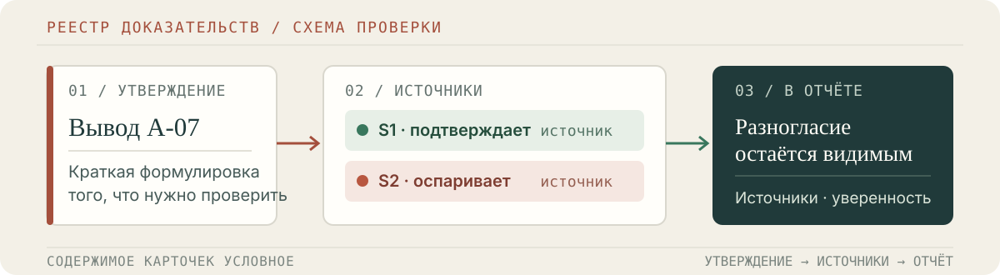
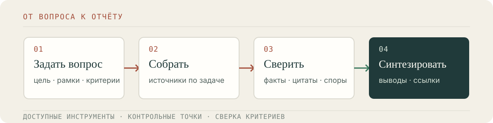

# Deep Research Skill

Навык для Claude Code, который проводит исследование по заданному вопросу и помогает проследить выводы до источников, проверок и оценки уверенности.

  

Концептуальная схема: карточки не содержат реальных результатов исследования.

**Плагин Claude Code · Русский язык · MIT**

## Когда пригодится

- Исследовать рынок, компанию, технологию или отрасль.
- Сравнить несколько вариантов по заданным критериям.
- Разобрать сложный вопрос на проверяемые утверждения и подготовить структурированный отчёт.

Навык учитывает ограничения задачи, собирает сведения из доступных инструментов, проверяет выводы и показывает, где источники подтверждают друг друга, расходятся или не дают ответа.

## Как устроен процесс

  

1. **Сформулировать вопрос** — задать цель, рамки и критерии результата.
2. **Собрать источники** — разбить работу на подзадачи и начинать с доступных инструментов, подключая дополнительные по необходимости.
3. **Проверить утверждения** — сопоставить источники, сверить цитаты там, где они используются, и учитывать отозванные или зависимые публикации.
4. **Подготовить отчёт** — отделить подтверждённое от спорного и неизвестного, добавить ссылки и оценку уверенности.

Промежуточные состояния и контрольные точки помогают продолжить работу после прерывания. Проверки повышают прослеживаемость, но не гарантируют, что все выводы верны или что найдены все значимые источники.

## Быстрый старт

Добавь маркетплейс и установи плагин в Claude Code:

~~~text
/plugin marketplace add azagreev/DResearch-Skill
/plugin install deep-research-skill@deep-research-skill
~~~

После установки навык может активироваться по запросу на исследование. Его также можно вызвать явно:

~~~text
/deep-research-skill:deep-research-skill
~~~

Например:

~~~text
Сравни A и B.
Рынок: [рынок].
Критерии: [список].

Для каждого вывода:
- источники и разногласия;
- что не удалось проверить.
~~~

Инструкции для Cowork, Claude.ai и ручной установки собраны в [руководстве по установке](docs/installation.md).

## Что входит в репозиторий

- **Плагин и точка входа навыка:** [каталог плагина](plugins/deep-research-skill/) и [SKILL.md](plugins/deep-research-skill/skills/deep-research-skill/SKILL.md).
- **Исполняемый Python-движок:** [engine/](plugins/deep-research-skill/skills/deep-research-skill/engine/) — обработка, оценка и проверка собранных данных.
- **Руководства:** [установка](docs/installation.md), [использование](docs/usage.md) и [полная спецификация](plugins/deep-research-skill/skills/deep-research-skill/SKILL.master.md).
- **Примеры:** [пример оркестрации](examples/supervised_orchestrator.workflow.js) и [чек-лист ретроспективы](examples/retro_checklist.md).
- **История изменений:** [CHANGELOG.md](CHANGELOG.md).

## Ограничения

Результат зависит от доступности источников и выбранных инструментов. Оценка уверенности — сигнал для проверки, а не вероятность истинности или гарантия полноты. Дополнительные внешние сервисы могут требовать отдельной настройки и оплаты.

## Лицензия

[MIT](LICENSE).