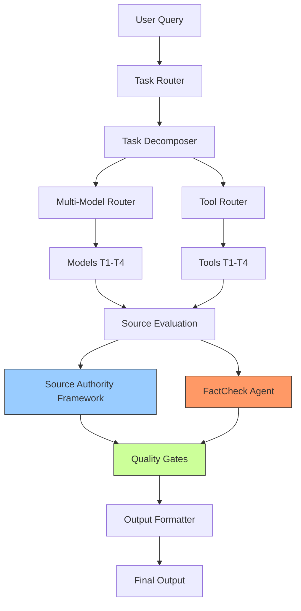

# SKILL.master.md — Deep Research Skill: Полная Мастер-Документация

> **Версия:** 2.0.0 | **Дата:** 2025-01-28 | **Статус:** Production-Ready
>
> Этот документ — единый источник truth (SSOT) для всех компонентов Deep Research Skill.
> Он объединяет результаты 17 исследовательских работ, проведённых в январе-июне 2025/2026.

---

## Содержание

1. [Core Philosophy — 8 Принципов](#1-core-philosophy--8-принципов)
2. [Architecture Overview](#2-architecture-overview)
3. [Multi-Model Router](#3-multi-model-router)
4. [Task Decomposition Engine](#4-task-decomposition-engine)
5. [Tool Router](#5-tool-router)
6. [Source Authority Framework](#6-source-authority-framework)
7. [FactCheck Agent (FCA)](#7-factcheck-agent-fca)
8. [Strategy Guide](#8-strategy-guide)
9. [Quality Gates](#9-quality-gates)
10. [Output Formats](#10-output-formats)
11. [AGENT Protocol](#11-agent-protocol)
12. [CAPTCHA Module](#12-captcha-module)
13. [Bypass / Paywall](#13-bypass--paywall)
14. [Distribution](#14-distribution)
15. [References](#15-references)

---

## 1. Core Philosophy — 8 Принципов

### 1.1 Эпистемическая Осмотичность (Epistemic Osmosis)

**Принцип:** Знание проникает через множественные мембраны источников, а не через один канал.

**Раскрытие:** Любое глубокое исследование должно опираться на минимум 3 независимых типа источников (например: официальная документация + первичные данные + экспертный анализ). Одноканальное исследование — это реклама, не исследование. Многоуровневая система верификации (WebSearch → Semantic Scholar → CrossRef → arXiv) обеспечивает кросс-индексную триангуляцию.

### 1.2 Эвристическая Резонансность (Heuristic Resonance)

**Принцип:** Качество ответа определяется не громкостью голоса источника, а гармонией множественных сигналов.

**Раскрытие:** Истина эмерджентна — она возникает из пересечения независимых линий доказательств. Иерархия доказательств (7 уровней: от Systematic Reviews до Expert Opinion) даёт вес каждому источнику. Конфликты между Tier S и Tier A источниками разрешаются через эвристику когнитивного авторитета.

### 1.3 Стратифицированная Достоверность (Stratified Fidelity)

**Принцип:** Не все факты равны. Система должна явно маркировать уровень достоверности каждого утверждения.

**Раскрытие:** 6 категорий фактчеккинга (✅ ВЕРНО, ❌ НЕВЕРНО, ⏰ УСТАРЕЛО, ⚠️ НЕПОЛНО, 🔮 ПЕРСПЕКТИВА, ❓ НЕПРОВЕРИМО) + 5 уровней confidence (🟢 Подтверждено, 🟡 Высокая, 🟠 Средняя, 🔴 Низкая, ⚪ Непроверимо). Каждое утверждение несёт трёхслойный якорь: Source Existence Proof → Claim-to-Source Locator → Claim Fidelity Assessment.

### 1.4 Прозрачная Верифицируемость (Transparent Verifiability)

**Принцип:** Вся цепочка рассуждений должна быть аудируема.

**Раскрытие:** Каждый вывод должен быть отслеживаем к исходному источнику через систему цитирования с номерами в формате `[^N^](url)`. Trust-Chain Frontmatter для каждого документа: `lookup_verified`, `verification_timestamp`, `crossref_status`. Anti-Hallucination Mandate: NEVER полагаться на память AI — каждая ссылка верифицируется через WebSearch/API.

### 1.5 Экономическая Осведомлённость (Economic Awareness)

**Принцип:** Каждое решение об инструменте стоит денег. Система должна оптимизировать cost-quality trade-off.

**Раскрытие:** 4 тира стоимости инструментов (T1 Free → T2 ~$0.001 → T3 Variable → T4 ~$0.003+). Бюджетная система: Low ($0.10), Medium ($0.50), High ($2.00), Unlimited. Cost-aware routing: начинать с дешёвых инструментов, эскалировать при необходимости. 30-40% запросов — lightweight задачи, для которых small model даёт 10-20x экономию.

### 1.6 Рекурсивная Глубина (Recursive Depth)

**Принцип:** Исследование должно уметь углубляться до тех пор, пока не исчерпана значимая информация.

**Раскрытие:** 4 уровня глубины: Quick (15 мин), Standard (1-3 часа), Deep (3-5 часов), Exhaustive (5+ часов). DRGN (Decision-Region Graph Network) определяет, какие subtasks порождают дочерние. Снежный ком запросов: первичные находки порождают вторичные исследовательские вопросы.

### 1.7 Контекстуальная Пластичность (Contextual Plasticity)

**Принцип:** Один и тот же запрос требует разных подходов в разных контекстах.

**Раскрытие:** 4 Route (A: Landscape, B: Technical Deep-Dive, C: Document Analysis, D: File-Augmented) + 13 Sub-routes. Адаптивная маршрутизация research subtasks: тип задачи + ожидаемая сложность + требуемый контекст → выбор модели и инструментов. Формат вывода подстраивается под запрос: Research Report, Executive Brief, Fact Sheet, Annotated Bibliography, Comparison Matrix, Timeline.

### 1.8 Graceful Degradation (Изящная Деградация)

**Принцип:** При отказе любого компонента система должна продолжать работу с пониженным качеством, а не останавливаться.

**Раскрытие:** Многоуровневые fallback chains: Tool-level (3+ альтернативы на задачу) → Model-level (fallback chains между tiers) → Provider-level (переключение между LLM-провайдерами) → Circuit Breaker (временное отключение failing tool). Checkpoint/recovery: прогресс сохраняется после каждой фазы. Бюджетный early-stop: при достижении 80% бюджета — graceful degradation.

---

## 2. Architecture Overview

### 2.1 High-Level Architecture

```
+------------------------------------------------------------------+
|                     Deep Research Skill v2.0                        |
+------------------------------------------------------------------+
|                                                                    |
|  +------------------+  +------------------+  +------------------+  |
|  |   User Query     |  |   File Uploads   |  |   Budget Config  |  |
|  +--------+---------+  +--------+---------+  +--------+---------+  |
|           |                     |                     |            |
|           v                     v                     v            |
|  +--------------------------------------------------------------+  |
|  |                    TASK ROUTER (Layer 1)                      |  |
|  |     Keyword → Route (A/B/C/D) + Sub-route (13 patterns)       |  |
|  +---------------------------+------------------------------------+  |
|                               |                                     |
|                               v                                     |
|  +--------------------------------------------------------------+  |
|  |              TASK DECOMPOSER (DRGN Engine)                    |  |
|  |   Query → Subtasks → Dependencies → Execution Plan            |  |
|  +---------------------------+------------------------------------+  |
|                               |                                     |
|              +----------------+----------------+                    |
|              |                                 |                    |
|              v                                 v                    |
|  +------------------------+      +-------------------------+       |
|  |  MULTI-MODEL ROUTER    |      |   TOOL ROUTER           |       |
|  |  (4 Tiers, fallback)   |      |  (3D Cost Matrix)       |       |
|  +--------+-------+-------+      +--------+---------+------+       |
|           |       |                       |          |             |
|           v       v                       v          v             |
|  +--------+-------+-------+      +--------+---------+------+       |
|  |  MODEL TIER 1-4         |      |  TOOL TIER 1-4           |       |
|  |  Volume/Standard/       |      |  Free → Premium          |       |
|  |  Complex/Specialized    |      |  30+ instruments         |       |
|  +-------------------------+      +--------------------------+       |
|                               |                                     |
|                               v                                     |
|  +--------------------------------------------------------------+  |
|  |              SOURCE AUTHORITY FRAMEWORK                       |  |
|  |    Tier S/A/B/C/D × 6 Domains × Conflict Resolution          |  |
|  +---------------------------+------------------------------------+  |
|                               |                                     |
|                               v                                     |
|  +--------------------------------------------------------------+  |
|  |              FACTCHECK AGENT (FCA)                            |  |
|  |    6 Categories × 6 Strategies × Independent Execution        |  |
|  +---------------------------+------------------------------------+  |
|                               |                                     |
|                               v                                     |
|  +--------------------------------------------------------------+  |
|  |              QUALITY GATES (5 Gates)                          |  |
|  |    Input → Extraction → Verification → Synthesis → Output     |  |
|  +---------------------------+------------------------------------+  |
|                               |                                     |
|                               v                                     |
|  +--------------------------------------------------------------+  |
|  |              OUTPUT FORMATTER (6 Formats)                     |  |
|  |    Progressive Disclosure + Adaptive Selection                |  |
|  +--------------------------------------------------------------+  |
|                                                                    |
+------------------------------------------------------------------+
|  AGENT PROTOCOL: Heartbeat → Checkpoints → Recovery → Telemetry  |
+------------------------------------------------------------------+
```

### 2.2 Data Flow

```
[User Query]
    |
    v
[Route Classifier] ──Route A/B/C/D──┐
    |                               |
    v                               v
[Subtask Decomposer]        [Budget Allocator]
    |                               |
    v                               v
[Execution Engine] ←──tools──→ [Cost Monitor]
    |
    ├──→ [Web Search] ──→ [Source Pool]
    ├──→ [Browser] ──→ [Content Extract]
    ├──→ [Data Sources] ──→ [Structured Data]
    ├──→ [Academic APIs] ──→ [Verified Facts]
    └──→ [Code Execution] ──→ [Analysis]
    |
    v
[FactCheck Agent] ──verification──┐
    |                               |
    v                               v
[Quality Gates] ←──feedback──── [Source Authority]
    |
    v
[Output Formatter] ──6 formats──┐
    |                            |
    v                            v
[Final Report] + [AGENT Heartbeat] → [User]
```

### 2.3 Component Interaction Matrix



### 2.4 Key Design Decisions

| Решение | Обоснование |
|---------|-------------|
| Отдельный FactCheck Agent | Исследования ARS показали: same-source hallucination — 31% ошибок проходят self-review. Независимый агент снижает до ~5-10% |
| 4-Tier Model Router | Паттерн из models.dev/OpenCode: 30-40% запросов — lightweight, 10-20x экономия через small models |
| 3D Cost Matrix | Cost × Latency × Quality — оптимизация по трём осям одновременно |
| DRGN вместо статического плана | Рекурсивное порождение subtasks по находкам, а не заранее |
| Progressive Disclosure | Формат "Layer Cake": Executive Snapshot → Key Findings → Full Body → Methodology |

---

## 3. Multi-Model Router

### 3.1 Architecture Foundation

Основано на исследовании **models.dev** (open-source catalog 2400+ моделей) и паттернах routing'а из **OpenCode**. Ключевой insight: models.dev — это data source; routing реализуется на уровне приложения.

### 3.2 4-Tier Model Architecture

```
┌─────────────────────────────────────────────────────────────────────────┐
│                    MULTI-MODEL ROUTER                                    │
├─────────────┬─────────────┬─────────────┬─────────────┬────────────────┤
│   Aspect    │   TIER 1    │   TIER 2    │   TIER 3    │   TIER 4       │
│             │  Volume     │  Standard   │  Complex    │  Specialized   │
├─────────────┼─────────────┼─────────────┼─────────────┼────────────────┤
│ Purpose     │ Lightweight │ Core tasks  │ Deep work   │ Frontier       │
│             │ tasks       │             │             │ capabilities   │
├─────────────┼─────────────┼─────────────┼─────────────┼────────────────┤
│ Models      │ DeepSeek    │ DeepSeek    │ Kimi K2.6   │ Claude Opus    │
│             │ V4 Flash    │ V4 Pro      │ GLM-5.1     │ 4.7            │
│             │ Qwen3.5 Plus│ Qwen3.6 Plus│             │ GPT-5.4 Pro    │
├─────────────┼─────────────┼─────────────┼─────────────┼────────────────┤
│ Cost/M      │ ~$0.14-0.30 │ ~$0.30-1.0  │ ~$0.60-2.5  │ ~$2.5-30       │
│ input       │             │             │             │                │
├─────────────┼─────────────┼─────────────┼─────────────┼────────────────┤
│ Rate Limit  │ 31,650/5hr  │ 3,300-3,450 │ 880-1,290   │ 100-500        │
├─────────────┼─────────────┼─────────────┼─────────────┼────────────────┤
│ Context     │ 1M          │ 1M          │ 204-262K    │ 922K-1M        │
├─────────────┼─────────────┼─────────────┼─────────────┼────────────────┤
│ Use For     │ Query gen,  │ Feature     │ Multi-file  │ Screenshot-to  │
│             │ summarizat- │ implement,  │ refactoring,│ code, 8-hour   │
│             │ ion, search │ multi-step  │ architecture│ autonomous runs│
│             │ execution   │ debugging   │ decisions   │ spec-writing   │
└─────────────┴─────────────┴─────────────┴─────────────┴────────────────┘
```

### 3.3 Routing Logic

```typescript
interface ResearchTask {
  type: 'deep_research' | 'fact_check' | 'summarize' | 'synthesize' | 'generate_query';
  complexity: 'low' | 'medium' | 'high' | 'frontier';
  expected_tokens: number;
  requires_reasoning: boolean;
  requires_vision: boolean;
  time_budget_ms: number;
}

function routeResearchTask(task: ResearchTask): ModelSelection {
  // Tier 1: Volume Workhorse — никогда не упираемся в лимиты
  if (task.complexity === 'low' || task.expected_tokens < 1000) {
    return { model: 'deepseek-v4-flash', tier: 1, fallback: 'qwen3.5-plus' };
  }
  // Tier 2: Standard Engineering — баланс
  if (task.complexity === 'medium' && !task.requires_reasoning) {
    return { model: 'deepseek-v4-pro', tier: 2, fallback: 'qwen3.6-plus' };
  }
  // Tier 3: Complex Agentic — elite
  if (task.complexity === 'high' || task.requires_reasoning) {
    return { model: 'kimi-k2.6', tier: 3, fallback: 'deepseek-v4-pro' };
  }
  // Tier 4: Specialized Capabilities — frontier
  return { model: 'claude-opus-4-7', tier: 4, fallback: 'glm-5.1' };
}
```

### 3.4 Fallback Chains

| Primary | Fallback 1 | Fallback 2 | Fallback 3 | Final |
|---------|-----------|-----------|-----------|-------|
| Claude Opus 4.7 | Kimi K2.6 | DeepSeek V4 Pro | Qwen3.6 Plus | DeepSeek V4 Flash |
| Kimi K2.6 | DeepSeek V4 Pro | Qwen3.6 Plus | DeepSeek V4 Flash | — |
| DeepSeek V4 Pro | Qwen3.6 Plus | DeepSeek V4 Flash | — | — |
| GLM-5.1 | Kimi K2.6 | DeepSeek V4 Pro | Qwen3.6 Plus | — |

**Fallback Triggers:** HTTP errors [400, 429, 503, 529] → max 3 attempts → cooldown 60s → provider blacklist на 10 минут.

### 3.5 Agent-Based Per-Model Assignment

| Агент | Роль | Модель Tier |
|-------|------|-------------|
| Orchestrator | Главный координатор | Tier 3 (Kimi K2.6) |
| Task Decomposer | Разбиение на subtasks | Tier 1 (Flash) |
| Search Executor | Выполнение поисков | Tier 1 (Flash) |
| Deep Analyzer | Глубокий анализ | Tier 3 (K2.6 / GLM-5.1) |
| FactCheck Agent | Верификация фактов | Tier 2 (V4 Pro) |
| Synthesizer | Синтез результатов | Tier 2 (Qwen3.6) |
| Report Writer | Генерация отчёта | Tier 3/4 (Opus 4.7) |
| Quality Gate | Контроль качества | Tier 2 (V4 Pro) |

### 3.6 Cost Budgeting per Session

```typescript
interface ResearchSessionBudget {
  total_dollar_budget: number;
  allocation: {
    planning: number;       // 10% — Tier 1
    search_queries: number; // 20% — Tier 1
    deep_analysis: number;  // 50% — Tier 3
    synthesis: number;      // 15% — Tier 2
    contingency: number;    // 5% — reserve
  };
  spent: number;
  current_tier: number;
}
```

**Rule of Thumb:** Если задача требует >100 запросов — начинать с Tier 1. Эскалировать наверх только при необходимости.

### 3.7 Adaptive Quality Escalation

```
1. Начать с cheap model (Tier 1)
2. Evaluate output quality (self-evaluation)
3. Если quality < threshold → escalate to better model
4. Повторять до достижения threshold или исчерпания budget
```

### 3.8 Rate-Limit-Aware Dynamic Routing

```json
{
  "runtime_fallback": {
    "enabled": true,
    "retry_on_errors": [400, 429, 503, 529],
    "max_fallback_attempts": 3,
    "cooldown_seconds": 60,
    "timeout_seconds": 30,
    "notify_on_fallback": true
  },
  "modelConcurrency": {
    "opencode-go/kimi-k2.6": 2,
    "opencode-go/deepseek-v4-pro": 3,
    "opencode-go/deepseek-v4-flash": 20,
    "opencode-go/glm-5.1": 1,
    "opencode-go/qwen3.6-plus": 5
  }
}
```

---

## 4. Task Decomposition Engine

### 4.1 Core Concepts

**DRGN (Decision-Region Graph Network):** Система, которая:
1. Разбивает исследовательский запрос на **атомарные subtasks**
2. Определяет **зависимости** между ними
3. Выбирает **оптимальный порядок** выполнения
4. **Динамически порождает** дочерние subtasks по мере обнаружения новых аспектов

### 4.2 8 Types of Subtasks

| # | Type | Description | Example | Tools |
|---|------|-------------|---------|-------|
| 1 | **Discovery** | Поиск и первичное обнаружение источников | "Найти 10 источников по теме X" | web_search, jina_search |
| 2 | **Extraction** | Извлечение конкретных данных из источника | "Извлечь цены с сайта Y" | browser_visit, firecrawl_scrape |
| 3 | **Verification** | Проверка фактов через перекрёстные ссылки | "Проверить утверждение Z" | web_search, cross-ref APIs |
| 4 | **Analysis** | Глубокий анализ, сравнение, корреляция | "Сравнить подходы A и B" | ipython, LLM synthesis |
| 5 | **Synthesis** | Объединение результатов в связный вывод | "Синтезировать выводы из N источников" | LLM (Tier 2-3) |
| 6 | **Documentation** | Структурированное документирование | "Оформить отчёт в формате APA 7" | write_file |
| 7 | **Quality Control** | Проверка качества и корректности | "Проверить цитаты на галлюцинации" | FCA, integrity agents |
| 8 | **Augmentation** | Углубление по найденным пробелам | "Исследовать аспект, упомянутый в источнике" | web_search, recursive |

### 4.3 DRGN Workflow

```
Input Query
    |
    v
+-----------------------------------+
| 1. PARSING & ENTITY EXTRACTION    |
|    - Извлечь ключевые сущности   |
|    - Определить тип запроса      |
|    - Оценить начальную сложность |
+-----------------------------------+
    |
    v
+-----------------------------------+
| 2. STATIC DECOMPOSITION           |
|    - Разбить на 8 типов subtasks  |
|    - Определить базовые          |
|      зависимости (DAG)            |
+-----------------------------------+
    |
    v
+-----------------------------------+
| 3. DEPTH ASSIGNMENT               |
|    - Quick: 2-5 subtasks          |
|    - Standard: 5-12 subtasks      |
|    - Deep: 12-23 subtasks         |
|    - Exhaustive: 38+ subtasks     |
+-----------------------------------+
    |
    v
+-----------------------------------+
| 4. DYNAMIC EXPANSION              |
|    - По находкам добавлять       |
|      дочерние subtasks            |
|    - Snowball sampling            |
|    - Gap analysis                 |
+-----------------------------------+
    |
    v
+-----------------------------------+
| 5. EXECUTION PLAN (Topological)   |
|    - Параллельные batches         |
|    - Критический путь             |
|    - Budget allocation per task   |
+-----------------------------------+
```

### 4.4 6 Decomposition Patterns

```yaml
Pattern_1_Cascade:
  description: "Цепочка зависимостей: каждый subtask зависит от предыдущего"
  example: "Поиск → Извлечение → Анализ → Синтез"
  use_when: "Линейные исследования с чёткой последовательностью"
  parallel: false

Pattern_2_Fan_Out:
  description: "Один родитель → много независимых дочерних"
  example: "Запрос → 10 параллельных поисков по разным аспектам"
  use_when: "Многогранные темы с независимыми аспектами"
  parallel: true
  max_agents: 10

Pattern_3_Reduce:
  description: "Много параллельных → один агрегирующий"
  example: "N источников → один синтез-отчёт"
  use_when: "Сбор данных из множества источников"
  parallel: "partial"

Pattern_4_Recursive:
  description: "Subtask порождает дочерние subtasks по находкам"
  example: "Поиск источника → обнаружение нового аспекта → новый поиск"
  use_when: "Исследование неизвестной области, snowball sampling"
  max_depth: 3

Pattern_5_Mixed:
  description: "Комбинация Fan-Out + Cascade"
  example: "Параллельное извлечение → последовательный анализ → параллельная верификация"
  use_when: "Стандартное исследование (Route A, Standard depth)"
  parallel: "mixed"

Pattern_6_Branch_Parallel:
  description: "Независимые ветви с разными инструментами"
  example: "Ветвь 1: Официальные источники + Ветвь 2: Коммьюнити + Ветвь 3: Техническая"
  use_when: "Route B (Technical Deep-Dive)"
  parallel: true
  max_agents: 3
```

### 4.5 Dependency Declaration Format

```yaml
subtask:
  id: "st-007"
  type: "deep_dive"
  description: "Deep extraction of source github.com/org/repo"
  depends_on: ["st-001", "st-002"]  # IDs блокирующих subtasks
  produces: ["repo_structure", "feature_list"]
  assigned_tool: "firecrawl_scrape"
  fallback_tool: "browser_visit"
  estimated_cost_usd: 0.01
  max_time_sec: 60
  quality_gate: "L1_Existence"
```

### 4.6 Phase-Based Agent Architecture (from ARS)

| Phase | Агенты | Deliverable |
|-------|--------|-------------|
| Phase 1 (Scoping) | research_question_agent, socratic_mentor_agent | RQ Brief + Methodology Blueprint |
| Phase 2 (Investigation) | bibliography_agent, source_verification_agent | Annotated Bibliography + Verification Report |
| Phase 3 (Analysis) | synthesis_agent, meta_analysis_agent, timeline_extraction_agent | Synthesis Report + Meta-Analysis |
| Phase 4 (Compilation) | report_compiler_agent | APA 7.0 Report |
| Phase 5 (Review) | editor_in_chief_agent, devils_advocate_agent | Editorial Review + Challenges |
| Phase 6 (Revision) | ethics_review_agent, monitoring_agent | Ethics Clearance + Monitoring Plan |


---

## 5. Tool Router

### 5.1 3D Cost Matrix

```
                        COST
         Low ($0)    Medium ($0.001)   High ($0.003+)
            │              │                │
            ├──────────────┼────────────────┤
    Fast    │ TIER 1       │ TIER 2         │ TIER 3
  (<3s)     │ web_search   │ jina_search    │ generate_image
            │ browser_click│ browser_visit  │ generate_video
            │ shell        │                │
            ├──────────────┼────────────────┤
    Medium  │ read_file    │ jina_reader    │ TIER 4
  (3-10s)   │ ipython      │ firecrawl_sc   │ firecrawl_crawl
            │ data sources │                │ jina_deepsearch
            ├──────────────┼────────────────┤
    Slow    │ —            │ —              │ firecrawl_agent
  (10s+)    │              │                │
            └──────────────┴────────────────┘
```

### 5.2 Full Tool Matrix (30+ Instruments)

#### TIER 1 — Native / Free (Start Here)

| Tool | Cost | Latency | Primary Use | Anti-Pattern |
|------|------|---------|-------------|--------------|
| `web_search` | $0 | 1-3s | Поиск источников, landscape scan | Using for extraction |
| `browser_visit` | $0 | 3-10s | Извлечение текста со страниц | For simple static pages (use Jina) |
| `browser_click` | $0 | 1-3s | Навигация, пагинация | Multiple back-and-forth |
| `browser_scroll` | $0 | 1-3s | Загрузка lazy content | Without purpose |
| `browser_screenshot` | $0 | 2-5s | Визуальная верификация | Excessive use |
| `browser_find` | $0 | 1-2s | Поиск на странице | — |
| `ipython` | $0 | <1-5s | Анализ данных, визуализация | Complex multi-step |
| `shell` | $0 | 1-3s | Валидация, обработка файлов | — |
| `read_file` | $0 | <1s | Чтение локальных файлов | — |
| `write_file` | $0 | <1s | Запись отчётов | — |
| `edit_file` | $0 | <1s | Модификация файлов | — |
| `find_asset_bbox` | $0 | 2-5s | Поиск image assets | — |
| `crop_and_replicate_assets` | $0 | 2-5s | Извлечение assets | — |
| `generate_speech` | $0* | 5-15s | Генерация аудио | *Requires voice |
| `generate_sound_effects` | $0* | 3-10s | Звуковые эффекты | *Requires desc |

#### TIER 2 — Jina AI (~$0.001/call)

| Tool | Cost | Latency | Primary Use | Fallback |
|------|------|---------|-------------|----------|
| `jina_search` (s.jina.ai) | ~$0.001 | 1-3s | Быстрый поиск с выдачей LLM-friendly | web_search |
| `jina_reader` (r.jina.ai) | ~$0.001 | 3-10s | Извлечение clean markdown со страницы | browser_visit |
| `jina_deepsearch` | ~$0.003+ | 30-120s | Глубокое исследование в режиме агента | Manual web_search loop |

#### TIER 3 — Creative (Variable)

| Tool | Cost | Latency | Primary Use | When to Use |
|------|------|---------|-------------|-------------|
| `generate_image` | Variable | 5-30s | Иллюстрации для отчётов | Only when needed |
| `generate_video` | Variable | 30-120s | Видео-иллюстрации | Rarely |
| `generate_speech` | Variable | 5-15s | Аудио-версия отчёта | Optional |

#### TIER 4 — Premium / Silver Bullet (~$0.003/call+)

| Tool | Cost | Latency | Primary Use | Fallback Chain |
|------|------|---------|-------------|----------------|
| `firecrawl_scrape` | $0.003-0.03 | 3-10s | Scrape с обходом anti-bot | browser_visit → jina_reader |
| `firecrawl_crawl` | $0.003-0.03 | 10-60s | Полный crawl сайта | Manual browser sequence |
| `firecrawl_search` | $0.003-0.03 | 3-10s | Поиск с извлечением | jina_search → web_search |
| `firecrawl_agent` | $0.01-0.10 | 30-300s | Autonomous agent scrape | Manual decomposition |
| `jina_deepsearch` | $0.003+ | 30-120s | Агентное глубокое исследование | web_search + synthesis |

### 5.3 Fallback Chains

```
Priority order for extraction tasks:
┌─────────────────┐
│ 1. browser_visit│ ← Start here (free, interactive)
└────────┬────────┘
         │ blocked / JS-heavy
         v
┌─────────────────┐
│ 2. jina_reader  │ ← Fast, clean markdown
└────────┬────────┘
         │ blocked / paywall
         v
┌─────────────────┐
│ 3. firecrawl_sc │ ← Anti-bot bypass
└────────┬────────┘
         │ fails
         v
┌─────────────────┐
│ 4. jina_deep    │ ← Autonomous deep research
│    search       │
└─────────────────┘

Priority order for search tasks:
┌─────────────────┐
│ 1. web_search   │ ← Free, broad
└────────┬────────┘
         │ insufficient
         v
┌─────────────────┐
│ 2. jina_search  │ ← LLM-friendly results
└────────┬────────┘
         │ insufficient
         v
┌─────────────────┐
│ 3. firecrawl_sch│ ← Search + extract
└────────┬────────┘
         │ insufficient
         v
┌─────────────────┐
│ 4. jina_deep    │ ← Autonomous research
│    search       │
└─────────────────┘
```

### 5.4 Tool Selection by Task Type

| I need to... | Start with | Fallback |
|-------------|-----------|----------|
| Search for sources | `web_search` | `jina_search` → `firecrawl_search` |
| Extract page text | `browser_visit` | `jina_reader` → `firecrawl_scrape` |
| Handle JS-heavy page | `browser_visit` (+wait) | `firecrawl_scrape` (with waitFor) |
| Bypass anti-bot | `firecrawl_scrape` | — |
| Crawl entire site | `firecrawl_crawl` | Manual browser sequence |
| Deep autonomous research | `jina_deepsearch` | Manual `web_search` loop |
| Extract structured data | `firecrawl_agent` | `browser_visit` + `ipython` parsing |
| Find images | `search_image_by_text` | `search_image_by_image` → `generate_image` |
| Process/analyze data | `ipython` | `shell` |
| Cross-check facts | `web_search` (multiple queries) | `jina_deepsearch` |

### 5.5 Cost Guardrails Implementation

```python
class ToolExecutor:
    """Безопасный executor с guardrails."""
    
    def __init__(self, budget: dict):
        self.budget = budget
        self.tier4_used = 0
        self.total_cost = 0.0
        self.attempted_tools = {}  # url -> set of attempted tools
        self.call_log = []
    
    async def execute(self, tool_call: ToolCall) -> Result:
        # Guardrail 1: Budget check
        budget_status = check_budget(
            self.budget["depth"], 
            self.tier4_used, 
            self.total_cost,
            self.elapsed_time
        )
        if budget_status["should_escalate"]:
            raise BudgetExceededException(budget_status["warnings"])
        
        # Guardrail 2: No retry loops
        url = tool_call.target_url
        tool_name = tool_call.tool_name
        if url in self.attempted_tools and tool_name in self.attempted_tools[url]:
            raise RetryLoopException(f"Already attempted {tool_name} on {url}")
        
        self.attempted_tools.setdefault(url, set()).add(tool_name)
        
        # Guardrail 3: Quality gate after extraction
        result = await self._run_tool(tool_call)
        
        if tool_call.expects_content:
            quality = quality_gate_check(result.content, tool_call.subtask)
            if not quality["passed"]:
                result.quality_passed = False
                result.failed_checks = quality["failed_checks"]
        
        # Update budget tracking
        if tool_call.tier == 4:
            self.tier4_used += 1
        self.total_cost += tool_call.estimated_cost
        
        self.call_log.append({
            "tool": tool_name,
            "url": url,
            "success": result.success,
            "quality_passed": getattr(result, "quality_passed", True),
            "cost": tool_call.estimated_cost,
            "time": result.elapsed_ms
        })
        
        return result
```

### 5.6 Tool Anti-Patterns

| Anti-Pattern | Problem | Solution |
|--------------|---------|----------|
| **"Tier 4 First"** | Использование Firecrawl для простых страниц | Always start with browser_visit or Jina Reader |
| **"Browser Spam"** | Множественные browser_visit туда-сюда | Batch URLs with Jina Reader parallel (up to 10) |
| **"No Quality Gate"** | Принятие пустого/blocked контента | Always run quality_gate_check() after extraction |
| **"Infinite Fallback Loop"** | Fallback Tier 4 → Tier 1 → Tier 4 | Track attempted tools per URL; never retry same |
| **"Budget Blindness"** | Продолжение при превышении бюджета | check_budget() после каждого major step |
| **"Parallel Panic"** | Параллельный запуск всех tier'ов | Sequential escalation: T1 → T2 → T4 |
| **"DeepSearch Overuse"** | Jina DeepSearch для простых фактов | web_search + browser_visit; DeepSearch for synthesis |

---

## 6. Source Authority Framework

### 6.1 Tier System

#### GLOBAL TIERS (Universal)

| Tier | Name | Description | Examples |
|------|------|-------------|----------|
| **S** | Canonical | Неоспоримые первичные источники | USPTO, SEC EDGAR, ISO standards, RFCs |
| **A** | Authoritative | Высокорепутабельные организации | McKinsey, Gartner, Nature, IEEE, ACM |
| **B** | Credible | Уважаемые, но менее проверяемые | Reuters, Bloomberg, ArsTechnica, Verge |
| **C** | Supplementary | Может использоваться с оговорками | Wikipedia, Stack Overflow, Medium |
| **D** | Avoid | Не использовать без явной необходимости | 4chan, Reddit (unverified), Tabloids |

#### DOMAIN-SPECIFIC TIERS

**Technology & AI:**
| Tier | Name | Examples |
|------|------|----------|
| S | Canonical | arXiv (verified), OpenAI blog (official), RFCs |
| A | Authoritative | Papers With Code, Hugging Face, distill.pub, IEEE |
| B | Credible | TechCrunch, Wired, MIT Technology Review |
| C | Supplementary | GitHub repos (unverified), Twitter/X threads, HN |
| D | Avoid | Medium (unverified), SEO blogs, AI-generated content |

**Finance & Economics:**
| Tier | Name | Examples |
|------|------|----------|
| S | Canonical | SEC EDGAR, FRED, Central Bank publications |
| A | Authoritative | IMF, World Bank, BIS, Moody's, S&P |
| B | Credible | Bloomberg, Reuters, FT, WSJ, Yahoo Finance |
| C | Supplementary | Seeking Alpha, Investopedia, Crunchbase |
| D | Avoid | Unverified Twitter accounts, pump blogs |

**Academic & Science:**
| Tier | Name | Examples |
|------|------|----------|
| S | Canonical | PubMed, Nature, Science, Cochrane, DOI-indexed |
| A | Authoritative | IEEE, ACM, Springer, Elsevier (top journals), Oxford |
| B | Credible | Quanta Magazine, ScienceDaily, arXiv |
| C | Supplementary | Wikipedia (science articles), science blogs |
| D | Avoid | Predatory journals, unverified preprints |

**News & Current Events:**
| Tier | Name | Examples |
|------|------|----------|
| S | Canonical | Official government statements, court documents |
| A | Authoritative | Reuters, AP, BBC, NYT, Guardian |
| B | Credible | Politico, Axios, Vox, The Atlantic |
| C | Supplementary | Wikipedia (current events), local news |
| D | Avoid | Tabloids, unverified social media, state propaganda |

**Health & Medicine:**
| Tier | Name | Examples |
|------|------|----------|
| S | Canonical | WHO, CDC, FDA, Cochrane, PubMed |
| A | Authoritative | NEJM, Lancet, JAMA, BMJ, Mayo Clinic |
| B | Credible | WebMD, Healthline, Medical News Today |
| C | Supplementary | Patient forums, health blogs |
| D | Avoid | Miracle cure sites, anti-vax, unverified wellness |

**Legal:**
| Tier | Name | Examples |
|------|------|----------|
| S | Canonical | Court opinions, statutes, regulations |
| A | Authoritative | Law reviews, ABA, Restatements |
| B | Credible | Legal news (Reuters Legal), Justia |
| C | Supplementary | Legal blogs, Wikipedia (law) |
| D | Avoid | Unverified legal advice, anonymous forums |

### 6.2 Conflict Resolution

```python
def resolve_conflict(source_a: Source, source_b: Source) -> Resolution:
    """
    Resolution hierarchy for conflicting sources:
    1. Higher tier wins (S > A > B > C > D)
    2. Same tier → primary source wins over secondary
    3. Same tier & type → more recent wins
    4. Same tier, type, date → academic consensus wins
    5. All equal → flag as UNRESOLVED, present both
    """
    tier_order = {"S": 5, "A": 4, "B": 3, "C": 2, "D": 1}
    
    if tier_order[source_a.tier] > tier_order[source_b.tier]:
        return Resolution(winner=source_a, reason="higher_tier")
    if tier_order[source_b.tier] > tier_order[source_a.tier]:
        return Resolution(winner=source_b, reason="higher_tier")
    
    # Same tier: primary vs secondary
    if source_a.is_primary and not source_b.is_primary:
        return Resolution(winner=source_a, reason="primary_source")
    if source_b.is_primary and not source_a.is_primary:
        return Resolution(winner=source_b, reason="primary_source")
    
    # Same tier & type: recency
    if source_a.date and source_b.date:
        if source_a.date > source_b.date:
            return Resolution(winner=source_a, reason="more_recent")
        if source_b.date > source_a.date:
            return Resolution(winner=source_b, reason="more_recent")
    
    # All equal
    return Resolution(winner=None, reason="unresolved", 
                     present_both=True, flag_for_review=True)
```

### 6.3 Evidence Hierarchy (7 Levels from ARS)

| Level | Тип доказательства | Вес | Примеры |
|-------|-------------------|-----|---------|
| **I** | Systematic Reviews / Meta-analyses | Highest | Cochrane, Campbell |
| **II** | Randomized Controlled Trials | Very High | RCT с пререгистрацией |
| **III** | Controlled Studies (non-randomized) | High | Quasi-experimental |
| **IV** | Case-Control / Cohort Studies | Moderate | Longitudinal studies |
| **V** | Systematic Reviews of Descriptive Studies | Moderate-Low | — |
| **VI** | Single Descriptive / Qualitative Studies | Low | Case studies |
| **VII** | Expert Opinion / Committee Reports | Lowest | Consensus reports |

### 6.4 Predatory Journal Detection

Агент проверяет источники через:
1. **Beall's List** — список хищнических издательств
2. **Cabells** — база данных журналов с черным списком
3. **DOAJ** — Directory of Open Access Journals (whitelist)

### 6.5 Triangulation Policy

Кросс-индексная триангуляция (k=2+):
- Каждый источник проверяется через минимум 2 независимых индекса (S2 + CrossRef + OpenAlex)
- Совпадение ≥2 индексов = высокая уверенность
- Несовпадение = advisory flag (`crossref_unmatched`, `s2_unmatched`)

---

## 7. FactCheck Agent (FCA)

### 7.1 Architecture Overview

FCA — **независимый** агент верификации, работающий отдельно от Research Agent. Основан на паттернах из Fintech Discovery Scraping Skill и ARS (Academic Research Skills).

```
+-----------------------------------------------------------+
│                  FACTCHECK AGENT (FCA)                    │
│                                                           │
│  Stage 0: ROUTING → Stakes assessment per claim           │
│       │                                                   │
│       v                                                   │
│  Stage 1: EXTRACTION → Atomic claims from findings        │
│       │                                                   │
│       v                                                   │
│  Stage 2: CLASSIFICATION → Claim type + strategies        │
│       │                                                   │
│       v                                                   │
│  Stage 3: SOURCE SEARCH → Multi-index search              │
│       │                                                   │
│       v                                                   │
│  Stage 4: SOURCE EVALUATION → Quality scoring             │
│       │                                                   │
│       v                                                   │
│  Stage 5: CATEGORIZATION → 6-category verdict             │
│       │                                                   │
│       v                                                   │
│  Stage 6: DOCUMENTATION → Citations + evidence            │
│       │                                                   │
│       v                                                   │
│  Stage 7: REPORT → Structured feedback                    │
│       │                                                   │
│       v                                                   │
│  Stage 8: FEEDBACK → To Research Agent (re-check loop)    │
+-----------------------------------------------------------+
```

### 7.2 6 Categories of Fact-Checking

| Категория | Символ | Описание | Действие |
|-----------|--------|----------|----------|
| **ВЕРНО** | ✅ | Подтверждается независимыми источниками | Принять как есть |
| **НЕВЕРНО** | ❌ | Опровергается авторитетными источниками | Удалить + исправить |
| **УСТАРЕЛО** | ⏰ | Было верно, но данные устарели | Обновить + пометить дату |
| **НЕПОЛНО** | ⚠️ | Частично верно, но не хватает контекста | Дополнить контекстом |
| **ПЕРСПЕКТИВА** | 🔮 | Спорное утверждение, не факт | Переформулировать как мнение |
| **НЕПРОВЕРИМО** | ❓ | Невозможно подтвердить или опровергнуть | Пометить + сообщить пользователю |

### 7.3 6 Verification Strategies

| # | Strategy | When to Use | Cost |
|---|----------|-------------|------|
| 1 | **Cross-reference** (2+ независимых источника) | Default для всех factual claims | Low |
| 2 | **Primary source check** | Цифры, даты, прямые цитаты | Medium |
| 3 | **Statistical validation** | Числовые данные, агрегаты | Medium |
| 4 | **Temporal verification** | Даты, сроки, "последние" данные | Low |
| 5 | **Source quality assessment** | Спорные или сенсационные утверждения | Medium |
| 6 | **Domain expert consensus** | Сложные технические/научные вопросы | High |

### 7.4 Claim Classification System

```python
class ClaimClassifier:
    """Классификация утверждений по типу для выбора стратегий."""
    
    TYPES = {
        "numerical_absolute": "Числовое значение (выручка, население)",
        "numerical_ratio": "Относительный показатель (процент, CAGR)",
        "numerical_statistical": "Статистика (p-value, confidence interval)",
        "fact_current_state": "Текущее состояние (CEO компании, статус проекта)",
        "fact_historical": "Исторический факт (дата основания, событие)",
        "fact_causal": "Причинно-следственная связь",
        "fact_prediction": "Прогноз или предсказание",
        "fact_definition": "Определение или классификация",
        "quote_attribution": "Цитата и её авторство",
        "comparison": "Сравнение двух или более сущностей"
    }
    
    def select_strategies(self, claim_type: str, stakes: str) -> list[str]:
        """Выбор стратегий на основе типа claim и stakes."""
        base = ["cross_reference"]
        
        if claim_type.startswith("numerical"):
            base.extend(["primary_source_check", "statistical_validation"])
        if claim_type in ["fact_current_state", "fact_historical"]:
            base.extend(["primary_source_check", "temporal_verification"])
        if claim_type == "fact_prediction":
            base.extend(["source_quality_assessment", "domain_expert_consensus"])
        if claim_type == "fact_causal":
            base.extend(["statistical_validation", "domain_expert_consensus"])
            
        if stakes == "high":
            base = list(set(base + ["domain_expert_consensus"]))
            
        return base
```

### 7.5 Five-Type Citation Hallucination Taxonomy (from ARS)

| Тип | Код | Частота | Описание | Стратегия обнаружения |
|-----|-----|---------|----------|----------------------|
| **Total Fabrication** | TF | ~28% | Целая статья не существует | WebSearch title+author → no results |
| **Plausible Author/Conf** | PAC | ~23% | Реальный учёный, но работа не его | Проверка публикаций через Google Scholar |
| **Incomplete Hallucination** | IH | ~19% | Отсутствуют детали (DOI, volume, pages) | Флаг, если нет DOI + volume + pages |
| **Partial Hallucination** | PH | ~18% | Микс реальных элементов из разных источников | Кросс-проверка ВСЕХ метаданных |
| **Minor Distortion** | MD | ~12% | Небольшие искажения (год, инициалы, venue) | Поштучное сравнение каждого поля |

### 7.6 Anti-Hallucination Mandate

**Core principle: Zero tolerance.**

- **NEVER** полагаться на память/знания AI для верификации
- Каждая ссылка верифицируется через WebSearch/API, независимо от того, насколько "знакомой" она кажется
- "Трудно верифицировать" — недопустимый вердикт. Каждая ссылка: VERIFIED или NOT_FOUND
- Книжные главы требуют усиленной верификации (поиск TOC или DOI)
- Кросс-проверка похожих ссылок (чтобы отловить mashup-галлюцинации)

### 7.7 Workflow Diagram

```
┌─────────────────┐     ┌──────────────────┐
│ Research Agent  │────►│ 0. ROUTING       │
│ (findings)      │     │    Stakes assess │
└─────────────────┘     └────────┬─────────┘
                                 │
                    ┌────────────┼────────────┐
                    ▼            ▼            ▼
              ┌─────────┐ ┌──────────┐ ┌──────────┐
              │ HIGH    │ │ MEDIUM   │ │ LOW      │
              │ All 6   │ │ Base 3-4 │ │ Cross-ref│
              │ strateg.│ │ strateg. │ │ only     │
              └────┬────┘ └────┬─────┘ └────┬─────┘
                   │           │            │
                   └───────────┼────────────┘
                               ▼
                    ┌──────────────────┐
                    │ 1. EXTRACTION    │
                    │    Atomic claims │
                    └────────┬─────────┘
                             │
                             ▼
                    ┌──────────────────┐
                    │ 2. CLASSIFICATION│
                    │    Type + strateg│
                    └────────┬─────────┘
                             │
              ┌──────────────┼──────────────┐
              ▼              ▼              ▼
        ┌──────────┐ ┌───────────┐ ┌──────────┐
        │WebSearch │ │  Academic │ │  Primary │
        │(general) │ │  APIs     │ │  Source  │
        └────┬─────┘ └─────┬─────┘ └────┬─────┘
             │             │            │
             └─────────────┼────────────┘
                           ▼
                    ┌──────────────────┐
                    │ 4. EVALUATION    │
                    │    Quality score │
                    └────────┬─────────┘
                             │
                             ▼
                    ┌──────────────────┐
                    │ 5. CATEGORIZATION│
                    │    ✅❌⏰⚠️🔮❓  │
                    └────────┬─────────┘
                             │
              ┌──────────────┼──────────────┐
              ▼              ▼              ▼
        ┌──────────┐ ┌───────────┐ ┌──────────┐
        │ ✅ Pass  │ │ ❌⚠️ Fix  │ │ ⏰🔮❓   │
        │          │ │           │ │ Flag     │
        └────┬─────┘ └─────┬─────┘ └────┬─────┘
             │             │            │
             └─────────────┼────────────┘
                           ▼
                    ┌──────────────────┐
                    │ 6. DOCUMENTATION │
                    │ 7. REPORT        │
                    └────────┬─────────┘
                             │
                             ▼
                    ┌──────────────────┐
                    │ 8. FEEDBACK      │◄──── Re-check loop (max 3)
                    │    To Research   │
                    └──────────────────┘
```

### 7.8 Cost-Aware Routing

```
STAKES ОПРЕДЕЛЕНИЕ:

HIGH STAKES (полная проверка, все стратегии):
├── Финансовые цифры, влияющие на инвестиционные решения
├── Медицинские утверждения, влияющие на здоровье
├── Юридические интерпретации с последствиями
└── Любое утверждение с confidence > 0.9 от Research Agent

MEDIUM STAKES (стандартный набор):
├── Общие рыночные тренды
├── Технические характеристики продуктов
├── Экономические обзоры
└── Утверждения с confidence 0.7–0.9

LOW STAKES (быстрая проверка):
├── Общие факты, широко известные
├── Исторические даты
├── Биографические данные
└── Утверждения с confidence < 0.7

COST LIMITS:
├── Max $0.50 per high-stakes claim
├── Max $0.20 per medium-stakes claim
├── Max $0.05 per low-stakes claim
└── Max $10.00 per full research batch
```

### 7.9 FCA API

```python
class FactCheckAgent:
    """Независимый агент фактчеккинга."""
    
    async def verify_batch(
        self,
        findings: list[Finding],
        domain: Domain,
        max_cost_usd: float = 10.0,
        min_coverage: float = 0.75
    ) -> VerificationReport:
        """Основной метод верификации батча утверждений."""
    
    async def verify_single(
        self,
        finding: Finding,
        domain: Domain,
        stakes: StakesLevel
    ) -> VerificationResult:
        """Проверка одного утверждения с учётом stakes."""
    
    def calculate_source_quality(self, source: Source) -> float:
        """SOURCE_QUALITY_SCORE по scorecard."""
    
    def categorize(
        self,
        finding: Finding,
        sources: list[Source],
        quality_scores: list[float]
    ) -> Category:
        """Присвоение одной из 6 категорий."""
```

### 7.10 Communication Protocol

**Research Agent → FCA:**
```json
{
  "batch_id": "research-batch-001",
  "domain": "finance",
  "findings": [
    {
      "id": "finding-001",
      "text": "Компания X выручила $50M в 2023 году",
      "source_mentioned": "SEC filing",
      "confidence": 0.95,
      "stakes": "high"
    }
  ]
}
```

**FCA → Research Agent:**
```json
{
  "batch_id": "research-batch-001",
  "verification_summary": {
    "total": 15,
    "VERIFIED": 10,
    "FALSE": 1,
    "OUTDATED": 1,
    "INCOMPLETE": 2,
    "PERSPECTIVE": 1,
    "UNCERTAIN": 0
  },
  "flagged_findings": [
    {
      "id": "finding-007",
      "correction": "Фактическая выручка $45M, не $50M",
      "required_action": "replace"
    }
  ]
}
```

### 7.11 Re-check Loop

```
Максимум 3 итерации исправлений:

Итерация 1: Research Agent получает feedback → исправляет → FCA re-check
Итерация 2: Если остались ❌/⏰/⚠️ → повторная коррекция → FCA re-check
Итерация 3: Если всё ещё есть проблемы → ESCALATION → Ручная проверка + пометка
```


---

## 8. Strategy Guide

### 8.1 Route Selection Framework

```
┌──────────────────────────────────────────────────────────────┐
│                    LAYER 1: KEYWORD ROUTER                   │
│                    (Fast Pattern Matching)                   │
│                                                              │
│  Input: User query string                                    │
│  Output: Route (A/B/C/D) + confidence score                │
│                                                              │
│  Heuristics (O(1) lookup):                                 │
│  - Contains "landscape", "overview", "market"       → A    │
│  - Contains "how to", "deep dive", "architecture"    → B    │
│  - Contains "file", "document", "PDF" + upload       → C    │
│  - Contains "validate", "compare", "benchmark"       → D    │
└──────────────────────────────────────────────────────────────┘
```

### 8.2 4 Routes + 13 Sub-routes

#### Route A: Landscape Research (Широкое исследование)

```
Route A — "Расширенный поиск + синтез"
Цель: Обеспечить широкое покрытие темы
Ключевые слова: landscape, overview, market analysis, trends, comparison, players
```

| Sub-route | Название | Триггер | Метод |
|-----------|----------|---------|-------|
| **A1** | Industry Overview | "landscape {topic}" | Множественный поиск → синтез |
| **A2** | Trend Analysis | "trends in {topic}" | Временной ряд + агрегация |
| **A3** | Competitive Comparison | "{A} vs {B}" | Side-by-side extraction |
| **A4** | Market Sizing | "market size {topic}" | Количественный поиск + валидация |
| **A5** | Stakeholder Mapping | "key players {topic}" | Entity extraction + ранжирование |
| **A6** | Regulatory Landscape | "regulation {topic}" | Нормативные источники + анализ |
| **A7** | Technology Maturity | "maturity of {tech}" | Gartner Hype Cycle + данные |
| **A8** | Ecosystem Analysis | "ecosystem {topic}" | Маппинг связей |
| **A9** | Investment/Funding | "funding {topic}" | Crunchbase + press releases |

**Алгоритм Route A:**
```
1. Generate 3-5 search queries (coverage-oriented)
2. Execute parallel search (all queries simultaneously)
3. Extract content from top 10 results per query
4. Score sources (authority + relevance)
5. Synthesize cross-source narrative
6. Validate key claims with FCA
7. Generate output in selected format
```

#### Route B: Technical Deep-Dive (Глубокое погружение)

```
Route B — "Точечное глубокое исследование"
Цель: Получить детальное понимание конкретного аспекта
Ключевые слова: how does, architecture, implementation, technical details, code
```

| Sub-route | Название | Триггер | Метод |
|-----------|----------|---------|-------|
| **B1** | Architecture Analysis | "how does {system} work" | Документация + code review |
| **B2** | Implementation Guide | "implement {feature}" | Code examples + tutorials |
| **B3** | API Documentation | "{service} API" | Официальные docs + примеры |
| **B4** | Performance Analysis | "{system} performance" | Бенчмарки + profiling |

**Алгоритм Route B:**
```
1. Search official documentation (priority: Tier S sources)
2. Search GitHub repos + code examples
3. Search technical blogs + tutorials
4. Deep extraction of 3-5 best sources
5. Cross-reference implementation details
6. Validate with code execution (if applicable)
7. Synthesize technical narrative
```

#### Route C: Document Analysis (Анализ документов)

```
Route C — "Документ → Извлечение + Анализ"
Цель: Извлечь структурированную информацию из загруженных файлов
Ключевые слова: analyze this file, extract from PDF, summarize document
```

| Sub-route | Название | Триггер | Метод |
|-----------|----------|---------|-------|
| **C1** | Document Summarization | "summarize {file}" | Чтение + LLM synthesis |
| **C2** | Structured Extraction | "extract {entities} from {file}" | Парсинг + шаблоны |
| **C3** | Cross-Document Analysis | "compare {file1} and {file2}" | Объединение + сравнение |
| **C4** | Table/Data Extraction | "get data from {file}" | Tabular extraction + валидация |

**Алгоритм Route C:**
```
1. Read and parse uploaded files
2. Identify document structure (sections, tables, entities)
3. Extract relevant content based on query
4. Cross-reference with web sources (if needed)
5. Structure output per user request
6. Validate extracted data
```

#### Route D: File-Augmented Research (Файл + Веб)

```
Route D — "Файл как якорь + веб-корреляция"
Цель: Использовать загруженный файл как базу + искать дополнительные данные
Ключевые слова: validate against market, compare to competitors, benchmark
```

| Sub-route | Название | Триггер | Метод |
|-----------|----------|---------|-------|
| **D1** | Data Validation | "validate {file} against {source}" | Кросс-проверка |
| **D2** | Market Benchmark | "how does {file} compare" | Бенчмаркинг |
| **D3** | Gap Analysis | "what's missing from {file}" | Поиск пробелов |

**Алгоритм Route D:**
```
1. Read uploaded file(s) — extract key entities/metrics
2. Use extracted data as search queries
3. Find external sources for comparison
4. Cross-reference file data with external sources
5. Identify gaps, inconsistencies, or validations
6. Synthesize augmented analysis
```

### 8.3 4 Depth Levels

#### Quick Depth (15-30 минут)

**Характеристики:**
- 3-5 источников
- Поверхностный поиск
- Краткий ответ
- Cost: $0.01-$0.05

```yaml
Quick_Depth:
  Discovery: 2 subtasks
    - "Top-level search (3 queries)"
    - "Source identification"
  Deep_Dive: 0 subtasks
  Synthesis: 1 subtask
    - "Brief synthesis"
  Validation: 0 subtasks
  Output: 1 subtask
    - "Quick summary"
```

#### Standard Depth (1-3 часа)

**Характеристики:**
- 5-10 источников
- Структурированный поиск
- Полный отчёт
- Cost: $0.05-$0.50

```yaml
Standard_Depth:
  Discovery: 3 subtasks
    - "Query expansion (5 variants)"
    - "Multi-source search (10 sources)"
    - "Source quality scoring"
  Deep_Dive: 3 subtasks
    - "Deep extraction of top 5 sources"
    - "Protected site handling (if needed)"
    - "Cross-reference verification"
  Synthesis: 2 subtasks
    - "Theme identification"
    - "Narrative construction"
  Validation: 1 subtask
    - "Spot-check key claims"
  Output: 1 subtask
    - "Structured report"
```

#### Deep Depth (3-5 часов)

**Характеристики:**
- 15-25 источников
- Рекурсивный поиск
- Code-level validation where applicable
- Cost: $0.50-$2.00

```yaml
Deep_Depth:
  Discovery: 4 subtasks
    - "Query expansion (10 variants)"
    - "Multi-source search (15 sources)"
    - "Source quality + credibility scoring"
    - "Snowball sampling (follow references)"
  Deep_Dive: 10 subtasks
    - "Deep extraction of top 10 sources"
    - "Protected site handling"
    - "Community source analysis"
    - "Technical validation / reproduction"
    - "Data extraction to structured format"
    - "Temporal analysis"
    - "Author/organization credibility check"
    - "Contradiction detection"
    - "Supplementary gap-filling search"
    - "Data consolidation and cleaning"
  Synthesis: 4 subtasks
    - "Theme identification + clustering"
    - "Evidence strength assessment"
    - "Narrative construction"
    - "Executive summary + detailed sections"
  Validation: 3 subtasks
    - "Fact verification (50% sample)"
    - "Source freshness + link validation"
    - "Peer review simulation"
  Output: 2 subtasks
    - "Report generation with full citations"
    - "Appendix with methodology + raw data"
```

#### Exhaustive Depth (5+ часов)

**Характеристики:**
- 25-50+ источников
- Полная воспроизводимость
- Публикационное качество
- Cost: $2.00-$10.00+

```yaml
Exhaustive_Depth:
  Discovery: 6 subtasks
    - "Systematic query generation (15+ variants)"
    - "Exhaustive source search (30+ sources)"
    - "Citation graph traversal"
    - "Grey literature search"
    - "Expert/authority identification"
    - "Source quality + bias assessment"
  Deep_Dive: 18 subtasks
    - "Full extraction of all relevant sources"
    - "Multi-tool fallback for each source"
    - "Structured data extraction to database"
    - "Temporal trend analysis"
    - "Geographic coverage analysis"
    - "Stakeholder perspective mapping"
    - "Technical deep-dives (multiple)"
    - "Reproduction of key claims"
    - "Statistical validation"
    - "Contradiction resolution"
    - "Confidence scoring per claim"
    - "Gap analysis with explicit limitations"
    - "Multiple supplementary search rounds"
    - "Archive/historical comparison"
    - "Cross-language source inclusion"
    - "Full data lineage tracking"
  Synthesis: 6 subtasks
    - "Multi-dimensional theme analysis"
    - "Evidence hierarchy construction"
    - "Scenario analysis"
    - "Iterative narrative refinement"
    - "Executive summaries (multiple lengths)"
    - "Visualizations + data tables"
  Validation: 5 subtasks
    - "100% fact verification"
    - "Source link validation"
    - "External expert review"
    - "Reproducibility verification"
    - "Bias audit"
  Output: 3 subtasks
    - "Full publication-ready report"
    - "Methodology appendix"
    - "Raw data + reproducibility package"
```

### 8.4 Depth Selection Guidelines

| User Signal | Recommended Depth |
|-------------|-------------------|
| "Quick check", "briefly", "tldr" | Quick |
| No depth signal | Standard (default) |
| "Thorough", "detailed", "comprehensive" | Deep |
| "Exhaustive", "complete", "academic", "publish" | Exhaustive |
| "Urgent", "ASAP", "fast" | Quick or Standard |
| Follow-up to previous research | Previous depth + 1 |
| Budget mentioned / constrained | Reduce by 1 level |

### 8.5 Budget System

```yaml
Budget_Tiers:
  Low:
    max_cost: "$0.10"
    default_depth: "Quick"
    available_routes: ["A", "B", "C"]
    tool_restrictions: ["Firecrawl batch only", "No CloakBrowser"]
    early_stop: "After $0.08"
  
  Medium:
    max_cost: "$0.50"
    default_depth: "Standard"
    available_routes: ["A", "B", "C", "D"]
    tool_restrictions: ["Firecrawl + Obscura allowed", "CloakBrowser: 1 use max"]
    early_stop: "After $0.40"
  
  High:
    max_cost: "$2.00"
    default_depth: "Deep"
    available_routes: ["A", "B", "C", "D"]
    tool_restrictions: ["All tools available", "CloakBrowser: unlimited"]
    early_stop: "After $1.60"
  
  Unlimited:
    max_cost: "No limit"
    default_depth: "Exhaustive"
    available_routes: ["A", "B", "C", "D"]
    tool_restrictions: "None"
    soft_guidance: "Warn if projecting > $5.00"
```

### 8.6 Cost Allocation per Phase

| Phase | Low | Medium | High | Unlimited |
|-------|-----|--------|------|-----------|
| Discovery | 40% | 25% | 20% | 15% |
| Deep Dive | 30% | 35% | 35% | 35% |
| Synthesis | 20% | 25% | 25% | 25% |
| Validation | 10% | 15% | 20% | 25% |

### 8.7 Cost Estimation Formula

```python
def estimate_cost(route, depth, source_count_hint=None):
    base_costs = {
        "A": {"Quick": 0.03, "Standard": 0.15, "Deep": 0.80, "Exhaustive": 3.00},
        "B": {"Quick": 0.02, "Standard": 0.12, "Deep": 0.60, "Exhaustive": 2.50},
        "C": {"Quick": 0.01, "Standard": 0.05, "Deep": 0.20, "Exhaustive": 1.00},
        "D": {"Quick": 0.04, "Standard": 0.25, "Deep": 1.20, "Exhaustive": 5.00}
    }
    
    source_multiplier = 1.0
    if source_count_hint:
        if source_count_hint > 20: source_multiplier = 1.5
        elif source_count_hint > 10: source_multiplier = 1.2
        elif source_count_hint < 3: source_multiplier = 0.7
    
    protection_likelihood = {"A": 0.2, "B": 0.1, "C": 0.0, "D": 0.15}
    protection_multiplier = 1 + (protection_likelihood[route] * 0.5)
    
    base = base_costs[route][depth]
    estimated = base * source_multiplier * protection_multiplier
    
    return {
        "estimated_cost": round(estimated, 2),
        "confidence_range": (round(estimated * 0.7, 2), round(estimated * 1.3, 2))
    }
```

### 8.8 Parallelization Framework

```yaml
Always_Parallel:
  - "Independent search queries"
  - "Fetching different URLs"
  - "File parsing (multiple files)"
  - "Fact verification checks"
  - "Source quality scoring"
  - "Content extraction from different sources"

Never_Parallel:
  - "Query depends on previous query results"
  - "Synthesis depends on extraction completion"
  - "Validation depends on synthesis output"
  - "Narrative construction depends on theme identification"

Conditional_Parallel:
  - "Deep extraction: parallel if sources independent"
  - "Multi-tool fallback: parallel attempt if uncertain"
```

### 8.9 Max Parallel Agents per Depth

| Depth | Max Parallel | Rationale |
|-------|-------------|-----------|
| Quick | 5 | Fast turnaround |
| Standard | 10 | Balance speed and cost |
| Deep | 15 | Complex research benefits |
| Exhaustive | 20 | Maximum throughput |

### 8.10 Confidence Scoring Framework

```yaml
Confidence_Scoring:
  Source_Level:
    factors:
      - "Domain authority (.edu, .gov, official): +0.3"
      - "Publication date (recent): +0.2"
      - "Author expertise: +0.2"
      - "Citation count: +0.1"
      - "Primary vs secondary: +0.2"
  
  Claim_Level:
    factors:
      - "Multiple corroborating sources: +0.4"
      - "Primary source verification: +0.3"
      - "Statistical evidence: +0.2"
      - "Expert consensus: +0.1"
  
  Output_Level:
    High: "0.8-1.0 — Strong evidence, verified"
    Medium: "0.5-0.79 — Reasonable evidence, some uncertainty"
    Low: "0.2-0.49 — Limited evidence, preliminary"
    Speculative: "0.0-0.19 — Hypothesis, needs validation"
```

---

## 9. Quality Gates

### 9.1 5 Gates Framework

```
[GATE 1: INPUT] ──→ [GATE 2: EXTRACTION] ──→ [GATE 3: VERIFICATION] ──→ [GATE 4: SYNTHESIS] ──→ [GATE 5: OUTPUT]
     │                      │                          │                         │                    │
     v                      v                          v                         v                    v
  Validate             Check content              Cross-verify              Check coherence         Validate
  query clarity        quality & size             facts with FCA            & structure             output format
  & feasibility        post-extraction                                     & completeness          & citations
```

### 9.2 Gate 1: Input Validation

**Purpose:** Проверить, что запрос ясен, выполним и соответствует возможностям системы.

```yaml
Input_Gate:
  checks:
    - "Query is not empty and > 5 characters"
    - "Query language is supported"
    - "Query is research-oriented (not conversational)"
    - "No PII or sensitive personal data in query"
    - "File attachments (if any) are readable"
    - "Route classification confidence > 0.6"
  
  fail_actions:
    - "Clarifying question to user"
    - "Suggest query reformulation"
    - "Reject if PII detected"
  
  pass_criteria: "All checks pass"
```

### 9.3 Gate 2: Extraction Quality

**Purpose:** Убедиться, что извлечённый контент качественный и пригодный для анализа.

```yaml
Extraction_Gate:
  checks:
    L1_Existence:
      - "Content exists and is extractable"
      - "Extracted content > 100 tokens"
      - "No extraction errors"
      severity: "BLOCKING"
    
    L2_Relevance:
      - "Semantic similarity to query > threshold"
      - "At least 1 relevant passage per source"
      - "Source topic matches query domain"
      severity: "WARNING"
    
    L3_Size:
      - "Content meets minimum size threshold"
      - "Not a paywall / login page"
      - "Not a 404 or error page"
      severity: "BLOCKING"
  
  fail_actions:
    L1: "Retry with alternative tool → flag source as failed"
    L2: "Refine query → remove source from pool"
    L3: "Skip source → note in methodology"
  
  pass_criteria: "L1 + L3 passed (L2 advisory)"
```

### 9.4 Gate 3: Fact Verification

**Purpose:** Проверить, что факты верифицированы через FCA.

```yaml
Verification_Gate:
  checks:
    - "FCA coverage >= threshold (Quick: 20%, Standard: 50%, Deep: 75%, Exhaustive: 100%)"
    - "All ❌ FALSE claims flagged and corrected"
    - "All ⏰ OUTDATED claims updated"
    - "All ⚠️ INCOMPLETE claims supplemented"
    - "No unverified HIGH-stakes claims in output"
    - "Cross-index triangulation: >=2 indices per academic source"
  
  thresholds_by_depth:
    Quick:     "Spot-check 1 claim"
    Standard:  "Spot-check 20% of claims"
    Deep:      "Spot-check 50% of claims"
    Exhaustive: "Verify 100% of claims"
  
  fail_actions:
    - "Send back to Research Agent for correction"
    - "Re-check loop (max 3 iterations)"
    - "If still failing → flag in output + notify user"
  
  pass_criteria: "Verification coverage >= threshold, no uncorrected FALSE claims"
```

### 9.5 Gate 4: Synthesis Quality

**Purpose:** Убедиться, что синтез связный, структурированный и отвечает на исходный вопрос.

```yaml
Synthesis_Gate:
  checks:
    L4_Accuracy:
      - "Spot-check facts against sources"
      - "No hallucinated statistics"
      - "Dates and numbers consistent"
      severity: "BLOCKING"
    
    L5_Currency:
      - "Source publication date within acceptable range"
      - "No broken links (sample)"
      - "Pricing/data from current period"
      severity: "ADVISORY"
    
    L6_Coverage:
      - "Min source count met"
      - "Domain diversity achieved"
      - "No single source dominates (>40%)"
      severity: "WARNING"
  
  thresholds_by_depth:
                Quick  Standard  Deep  Exhaustive
    L4 pass:     80%      90%     95%       98%
    L5 date:     Any     <2yr    <1yr     <6mo
    L6 sources:   3         8      15        25
  
  fail_actions:
    L4: "Flag claim as unverified → search corroborating source → remove if unverifiable"
    L5: "Add freshness warning → search updated source → note date in output"
    L6: "Expand query set → add related topics → reduce threshold"
  
  pass_criteria: "L4 passed (BLOCKING), L5-L6 advisory"
```

### 9.6 Gate 5: Output Validation

**Purpose:** Проверить, что финальный вывод соответствует формату, содержит цитаты и готов к выдаче.

```yaml
Output_Gate:
  checks:
    - "Output format matches requested format"
    - "All citations have corresponding sources in registry"
    - "No placeholder text ({{...}}) in final output"
    - "Executive Snapshot present (for depth >= Standard)"
    - "Reading time indicator present (for depth >= Deep)"
    - "Confidence levels stated for major claims"
    - "No uncorrected ❌ or unflagged ❓ claims"
    - "Document metadata block present (JSON)"
  
  fail_actions:
    - "Restructure output"
    - "Add missing sections"
    - "Escalate to higher-capacity model"
    - "Fill placeholders or remove them"
  
  pass_criteria: "All checks pass"
```

### 9.7 Auto-Remediation Actions

```yaml
Auto_Remediation:
  Extraction_Fail:
    action: "Retry with alternative tool → reduce extraction depth → flag source"
    max_retries: 2
  
  Verification_Fail:
    action: "Flag claim → search corroborating source → remove if unverifiable"
  
  Coverage_Fail:
    action: "Expand query set → add related topics → reduce depth threshold"
  
  Synthesis_Fail:
    action: "Restructure → add missing sections → escalate model"
  
  Budget_80%:
    action: "Graceful degradation → reduce scope → skip non-critical validation"
  
  Budget_90%:
    action: "Reduce scope significantly → deliver partial results"
```

### 9.8 Quality Gates Summary

| Gate | Name | Blocking | Key Metric | Fail Action |
|------|------|----------|------------|-------------|
| G1 | Input | Yes | Query clarity | Ask clarifying question |
| G2 | Extraction | Yes | Content quality | Retry with fallback tool |
| G3 | Verification | Yes | FCA coverage | Re-check loop (max 3) |
| G4 | Synthesis | Partial | Accuracy + Coverage | Expand / Escalate |
| G5 | Output | Yes | Format + Citations | Restructure / Fix |

---

## 10. Output Formats

### 10.1 Format Selection Logic

```
Query Pattern → Format Mapping:

Factual lookup / Definition    → Fact Sheet
Comparison / Evaluation        → Comparison Matrix
Chronology / Historical        → Timeline
Cause/Effect / Trend / How-to  → Research Report
Strategic decision             → Executive Brief
Literature-heavy               → Annotated Bibliography
```

### 10.2 Format 1: Research Report (default)

**Use for:** Сложные, многогранные темы; deep и exhaustive исследования.

```markdown
---
## Executive Snapshot

{{1-paragraph summary of the entire report — 150 words max}}

> **Reading time:** ~{{X}} minutes ({{Y}} words)

---

## Key Findings at a Glance

| # | Finding | Confidence |
|---|---------|------------|
| 1 | {{Finding 1}} | {{🟢🟡🟠🔴⚪}} |
| 2 | {{Finding 2}} | {{🟢🟡🟠🔴⚪}} |

---

## 1. Introduction

### Context
{{Background information}}

### Research Question
{{The specific question this report answers}}

### Methodology
{{Approach: routes, depth, sources consulted}}

---

## 2. {{Theme 1}}

### 2.1 {{Sub-theme}}
{{Content with inline citations [^1^]}}

### 2.2 {{Sub-theme}}
{{Content}}

---

## 3. {{Theme 2}}

---

## 4. Analysis

### 4.1 Key Insights
### 4.2 Implications
### 4.3 Limitations

---

## 5. Conclusion

---

## Sources

{{CITATION_REGISTRY}}

---

## Appendix

<details>
<summary>Full Methodology (click to expand)</summary>
{{Detailed methodology}}
</details>

<details>
<summary>Complete Source Registry ({{N}} sources)</summary>
{{Full sources with metadata}}
</details>
```

### 10.3 Format 2: Executive Brief

**Use for:** Быстрые ответы; стратегические решения; time-constrained readers.

```markdown
## Executive Brief: {{TITLE}}

**Prepared:** {{DATE}} | **Sources:** {{N}} | **Confidence:** {{🟢🟡🟠🔴⚪}}

---

### Bottom Line Up Front

{{3-5 sentence answer to the user's question}}

---

### Key Points

| # | Point | Evidence | Confidence |
|---|-------|----------|------------|
| 1 | {{Point}} | {{Source}} | {{🟢🟡🟠🔴⚪}} |

---

### Context

{{Brief background — 1 paragraph}}

---

### Recommendations

1. {{Actionable recommendation}} (Confidence: {{}})
2. {{Actionable recommendation}}

---

### Sources

{{Condensed citation registry — top 5 most important}}
```

### 10.4 Format 3: Fact Sheet

**Use for:** Factual lookups; definitions; quick verification.

```markdown
## Fact Sheet: {{SUBJECT}}

| Attribute | Value | Source | Confidence |
|-----------|-------|--------|------------|
| **Definition** | {{}} | [^1^] | 🟢 |
| **Key Statistic 1** | {{}} | [^2^] | 🟢 |
| **Key Statistic 2** | {{}} | [^3^] | 🟡 |
| **Related Concept** | {{}} | [^4^] | 🟢 |

### Quick Context

{{2-3 sentences placing the fact in context}}

### Sources

[^1^]: {{URL}} — {{Title}}
[^2^]: {{URL}} — {{Title}}
```

### 10.5 Format 4: Annotated Bibliography

**Use for:** Литературные обзоры; academic research; source-heavy topics.

```markdown
## Annotated Bibliography: {{TOPIC}}

**Sources:** {{N}} | **Date Range:** {{START}} – {{END}}

---

### Source 1: {{Title}}

**Citation:** {{Authors}}, {{Title}}, {{Publication}}, {{Year}}
**URL:** {{URL}} | **Accessed:** {{DATE}}
**Source Tier:** {{S/A/B/C}} | **Evidence Level:** {{I-VII}}

**Summary:** {{2-3 sentence summary}}

**Key Claims:**
- {{Claim 1}} ({{confidence}})
- {{Claim 2}} ({{confidence}})

**Relevance:** {{Why this source matters for the query}}

**Limitations:** {{Any caveats}}

---

### Synthesis

{{Cross-source analysis: agreements, contradictions, gaps}}

### Identified Gaps

{{What the literature doesn't cover}}
```

### 10.6 Format 5: Comparison Matrix

**Use for:** Сравнения технологий, продуктов, компаний.

```markdown
## Comparison: {{OPTION_A}} vs {{OPTION_B}} vs {{OPTION_C}}

**Dimensions:** {{N}} | **Sources:** {{M}}

---

### Scoring Summary

| Dimension | Weight | {{A}} | {{B}} | {{C}} | Winner |
|-----------|--------|-------|-------|-------|--------|
| {{DIM_1}} | {{W}}% | {{S}} | {{S}} | {{S}} | {{}} |
| {{DIM_2}} | {{W}}% | {{S}} | {{S}} | {{S}} | {{}} |
| **Total** | 100% | **{{S}}** | **{{S}}** | **{{S}}** | **{{}}** |

---

### {{DIM_1}} Deep Dive

| Aspect | {{A}} | {{B}} | {{C}} |
|--------|-------|-------|-------|
| {{Aspect}} | {{Val}} | {{Val}} | {{Val}} |

**Verdict:** {{WHICH_LEADS}} — {{RATIONALE}} {{CONFIDENCE_EMOJI}}

---

### Scenario-Based Recommendations

**If you prioritize {{DIM_X}}:** → {{OPTION}}
**If you prioritize {{DIM_Y}}:** → {{OPTION}}
**Balanced choice:** → {{OPTION}}

---

## Sources

{{CITATION_REGISTRY}}
```

### 10.7 Format 6: Timeline

**Use for:** Исторические события; эволюция технологий; project milestones.

```markdown
## Timeline: {{SUBJECT}}

**Period:** {{START}} – {{END}} | **Events:** {{N}}

---

### {{ERA_NAME}} ({{START}} – {{END}})

#### {{YYYY-MM-DD}}: {{EVENT_TITLE}}
**Confidence:** {{🟢🟡🟠🔴⚪}}

{{Description of the event}}

**Significance:** {{Why this matters}}
**Source:** [^N^]({{URL}})

---

#### {{YYYY-MM-DD}}: {{EVENT_TITLE}}

---

### Patterns & Insights

{{Recurring themes, acceleration/deceleration points}}

### Sources

{{CITATION_REGISTRY}}
```

### 10.8 Format-by-Depth-Level Mapping

| Depth Level | Default Format | Detail |
|-------------|----------------|--------|
| Quick | Fact Sheet | Single fact, 50-100 words |
| Standard | Research Report (abridged) | Core findings + analysis, 1,500-3,000 words |
| Deep | Research Report (full) | Full methodology + implications, 3,000-6,000 words |
| Exhaustive | Research Report + Bibliography | Everything + appendices, 6,000-10,000+ words |

### 10.9 Progressive Disclosure: "Layer Cake"

```
Layer 1 (Immediate): Executive Snapshot — 150 words, 10 seconds
Layer 2 (Quick):    Key Findings / At a Glance — 2-minute scan
Layer 3 (Standard): Full document body — 10-15 minute read
Layer 4 (Deep):     Methodology, Appendices, Full Sources — on demand
```

**Implementation in Markdown:**

```markdown
<!-- Layer 1: Always visible, always first -->
## Executive Snapshot
{{SUMMARY}}

---

<!-- Layer 2: TOC-linked, scannable -->
## Key Findings at a Glance
| # | Finding | Confidence |

---

<!-- Layer 3: Main content -->
## 1. Introduction
...

---

<!-- Layer 4: Collapsed by default -->
<details>
<summary>Full Methodology (click to expand)</summary>
## Methodology
...
</details>
```

### 10.10 Document Metadata Schema

```json
{
  "document": {
    "format": "research_report",
    "id": "rr-20250120-a1b2c3d4",
    "version": "1.0",
    "generated_at": "2025-01-20T14:30:00Z",
    "query": {
      "original": "How is the AI chip market evolving?",
      "depth_level": 4,
      "routes_used": ["A"],
      "estimated_cost": {"tool_calls": 12, "tokens": 45000}
    },
    "content": {
      "title": "The AI Chip Market: Evolution and Trajectory",
      "word_count": 5200,
      "section_count": 7,
      "reading_time_minutes": 18
    },
    "sources": {
      "consulted": 24,
      "cited": 18,
      "by_tier": {"T1": 8, "T2": 10, "T3": 4, "TX": 2}
    },
    "confidence": {
      "aggregate": {"score": 0.72, "level": "high", "emoji": "🟢"},
      "distribution": {
        "confirmed": 0.12, "high": 0.45, "medium": 0.30,
        "low": 0.10, "unverifiable": 0.03
      }
    },
    "formats_available": ["research_report", "executive_brief", "fact_sheet"]
  }
}
```

---

## 11. AGENT Protocol

### 11.1 Heartbeat System

```yaml
Heartbeat:
  frequency: "Every 5 minutes during active research"
  format:
    timestamp: "ISO 8601"
    session_id: "uuid"
    phase: "PLAN|GATHER|DEEPEN|VERIFY|SYNTH"
    progress_pct: "0-100"
    subtasks_completed: "N of M"
    budget_status:
      spent_usd: "float"
      remaining_usd: "float"
      tier4_calls: "int"
    quality_gates_passed: ["G1", "G2", ...]
    current_action: "Human-readable description"
    next_checkpoint: "Expected time"
  
  escalation_triggers:
    - "Budget > 80% spent"
    - "No progress for 10 minutes"
    - "3+ consecutive tool failures"
    - "FCA flags > 50% of claims"
```

### 11.2 Checkpoint Format

```yaml
checkpoint:
  timestamp: "2025-01-20T10:30:00Z"
  phase: "GATHER"
  subtask_id: "extract_company_info_001"
  tool_chain:
    - tool: "web_search"
      tier: 1
      status: "success"
      cost_usd: 0.0
      latency_ms: 2300
    - tool: "jina_reader"
      tier: 2
      status: "success"
      cost_usd: 0.001
      latency_ms: 7800
  quality_gate:
    passed: true
    content_length: 4523
  budget_status:
    tier4_used: 0
    total_cost_usd: 0.001
    time_elapsed_sec: 45
    status: "ok"
  recovery_point: true  # Can resume from here
```

### 11.3 Recovery Procedures

```yaml
Recovery:
  Circuit_Breaker:
    description: "Temporarily disable failing tool"
    threshold: "3 failures in 5 minutes"
    recovery_time: "10 minutes"
    fallback: "Use alternative tools"
  
  Retry_With_Backoff:
    description: "Exponential backoff for transient failures"
    max_retries: 3
    backoff: "1s, 2s, 4s"
    applies_to: ["Firecrawl", "Jina", "LLM"]
  
  Graceful_Degradation:
    description: "Reduce scope but deliver value"
    triggers: ["budget 80%", "time limit", "tool unavailability"]
    actions:
      - "Reduce source count"
      - "Use faster/cheaper tools"
      - "Skip non-critical validation"
      - "Deliver partial results"
  
  Checkpoint_Recovery:
    description: "Save progress at each phase"
    save_points: ["Post-Discovery", "Post-DeepDive", "Post-Synthesis"]
    benefit: "Resume from last checkpoint on failure"
  
  Degradation_Cascade:
    Full_Functionality
        → Reduced_Toolset (tool failure)
        → Minimal_Toolset (budget exceeded)
        → Partial_Results + Explanation
        → User_Notification + Recommendations
```

### 11.4 AGENT Protocol Constants

```yaml
Protocol_Constants:
  heartbeat_interval_sec: 300
  checkpoint_interval_sec: 600
  max_tool_retry: 3
  circuit_breaker_threshold: 3
  circuit_breaker_recovery_sec: 600
  budget_warning_pct: 80
  budget_critical_pct: 90
  max_recheck_iterations: 3
  fca_coverage_threshold: 0.75
  quality_gate_timeout_sec: 30
  session_timeout_hours: 8
  max_parallel_agents: 20
```

### 11.5 Telemetry & Logging

```yaml
Telemetry:
  events_logged:
    - "tool_call: {tool, tier, cost, latency, success}"
    - "model_call: {model, tier, tokens_in, tokens_out, cost}"
    - "quality_gate: {gate, passed, checks}"
    - "fca_result: {claim_id, category, confidence}"
    - "source_accessed: {url, tier, domain, authority_score}"
    - "budget_checkpoint: {spent, remaining, projected}"
  
  metrics_computed:
    - "cost_per_source"
    - "cost_per_claim_verified"
    - "tool_success_rate"
    - "fca_coverage_rate"
    - "average_latency_per_phase"
    - "quality_gate_pass_rate"
```


---

## 12. CAPTCHA Module

### 12.1 Philosophy: Stealth-First

**Core Principle:** CAPTCHA solving — крайняя мера. Первичная стратегия — избежать появления CAPTCHA через stealth-техники.

```
Decision Tree:
CAPTCHA encountered?
├── NO → Normal extraction
│
└── YES → Try anti-bot bypass first
    ├── Stealth browser (CloakBrowser)
    ├── Proxy rotation
    ├── Request pattern humanization
    └── If all fail → CAPTCHA solving service
```

### 12.2 Stealth-First Strategies

| Strategy | Tool | When | Effectiveness |
|----------|------|------|---------------|
| CloakBrowser | Patched Chromium | Локальный anti-detect browsing | reCAPTCHA score 0.9 |
| Browserbase Verified | Cloud verified browsers | Cloud automation | Built-in CAPTCHA solving |
| Proxy rotation | Residential proxies | IP-based блокировки | 201 страна |
| Human-like behavior | Bezier mouse, natural scroll | Behavior-based detection | Высокая |
| Request throttling | Rate limiting | Volume-based блокировки | Высокая |

### 12.3 CAPTCHA Solving Services (Fallback)

#### Service Comparison

| Service | reCAPTCHA v2 | reCAPTCHA v3 | Turnstile | Image CAPTCHA | Technology | Price/1K |
|---------|-------------|--------------|-----------|---------------|------------|----------|
| **SolveCaptcha** | $0.55 | $0.80 | $0.80 | $0.35 | Hybrid AI+Human | Lowest |
| **2Captcha** | $1.00+ | $1.45+ | $1.45 | $0.50+ | Human workers | Medium |
| **Anti-Captcha** | $0.95+ | $1.00+ | $2.00 | $0.50+ | Human workers | Medium |
| **CapSolver** | $0.80 | $1.00 | $1.20 | $0.40 | AI/ML | Medium |
| **CapMonster Cloud** | $0.50-0.80 | $0.50-2.00 | Supported | $0.20 | AI | Lowest |

#### SolveCaptcha Integration (Primary)

```python
from solvecaptcha import Solvecaptcha

# Initialize
solver = Solvecaptcha(apiKey="YOUR_API_KEY")

# Check balance
balance = solver.balance()

# Solve reCAPTCHA v2
result = solver.recaptcha(sitekey="6Ld...", url="https://example.com", version='v2')
token = result["code"]

# Solve Cloudflare Turnstile
result = solver.turnstile(sitekey="sitekey", url="https://example.com")

# Solve image CAPTCHA
result = solver.normal(file='path/to/captcha.png')
```

#### Multi-Provider Fallback Chain

```python
class CaptchaSolverChain:
    """Multi-provider CAPTCHA solving with fallback."""
    
    PROVIDERS = {
        'solvecaptcha': {'factory': lambda key: Solvecaptcha(apiKey=key)},
        'capsolver': {'factory': lambda key: CapSolver(apiKey=key)},
        'anticaptcha': {'factory': lambda key: AntiCaptcha(apiKey=key)},
    }
    
    def solve(self, captcha_type, **kwargs):
        """Try each provider in order until one succeeds."""
        for name, config in self.PROVIDERS.items():
            try:
                solver = config['factory'](self.keys[name])
                result = getattr(solver, captcha_type)(**kwargs)
                if result and result.get('code'):
                    return {'provider': name, 'result': result}
            except Exception as e:
                logger.warning(f"Provider {name} failed: {e}")
                continue
        raise Exception("All CAPTCHA providers exhausted")
```

**Recommended fallback order:**
1. **CapSolver** — Fastest, AI-based (for common types)
2. **SolveCaptcha** — Best price/performance ratio
3. **Anti-Captcha** — Most reliable fallback
4. **2Captcha** — Widest type coverage

### 12.4 Cost Tracking

```python
class CostTracker:
    """Track CAPTCHA solving costs across sessions."""
    
    PRICING = {
        'recaptcha_v2': 0.00055,    # $0.55/1000
        'recaptcha_v3': 0.00080,    # $0.80/1000
        'turnstile': 0.00080,       # $0.80/1000
        'image': 0.00035,           # $0.35/1000
        'geetest': 0.00080,         # $0.80/1000
    }
    
    def log_solve(self, provider, captcha_type, success=True):
        entry = {
            'timestamp': datetime.utcnow().isoformat(),
            'provider': provider,
            'type': captcha_type,
            'cost_usd': self.PRICING.get(captcha_type, 0),
            'success': success
        }
        # Append to log
```

### 12.5 When NOT to Use CAPTCHA Solving

- Sites with **explicit anti-scraping policies** and legal enforcement
- **Financial services** (banking, trading platforms)
- **Healthcare data** (HIPAA-covered entities)
- **Government services** without authorization
- **Ticketing sites** (strong legal precedent against circumvention)
- Any site where data is **not publicly available**

### 12.6 Legal & Ethical Considerations

**United States:**
- CAPTCHA bypassing may be interpreted as "exceeding authorized access" under CFAA
- Case *hiQ Labs v. LinkedIn* (2022): scraping public data is legal, but circumventing access controls creates risk
- Violating Terms of Service is generally a **civil matter**, not criminal

**European Union:**
- GDPR applies to data collection regardless of method
- EU Digital Services Act requires transparency in automated data collection

**Best Practices:**
1. Respect robots.txt directives
2. Minimize server load — use rate limiting, cache results
3. Collect only necessary data — data minimization
4. Use official APIs when available
5. Document usage — maintain audit trail

---

## 13. Bypass / Paywall

### 13.1 Core Principle: Legal Methods Only

**LEGAL_METHODS — единственные допустимые методы обхода paywall.**

```
┌─────────────────────────────────────────────────────────────┐
│                    LEGAL_METHODS ONLY                       │
│                                                             │
│  ✅ ALLOWED:                                                │
│  • Jina Reader (r.jina.ai/http://URL)                      │
│  • Archive.org / Archive.ph                                 │
│  • RSS feeds (often contain full text)                      │
│  • Open access versions (Unpaywall, OA Button)              │
│  • Author's personal website / preprint server              │
│  • Semantic Scholar (free full-text PDFs)                   │
│  • Google Scholar → [PDF] links                             │
│  • Library consortium access (if available)                 │
│  • Free trial registration (if ToS allows)                  │
│                                                             │
│  ❌ NEVER:                                                  │
│  • Stolen credentials (account sharing)                     │
│  • Extension piracy (bypassing payment)                     │
│  • Manipulating URL parameters to trick paywall JS          │
│  • Using someone else's institutional login                 │
│  • Scraping content that requires paid subscription         │
│  • Circumventing technical protection measures              │
└─────────────────────────────────────────────────────────────┘
```

### 13.2 Jina Reader Paywall Bypass

**Mechanism:** Jina Reader (r.jina.ai/) fetches and extracts content through its own infrastructure, effectively bypassing many client-side paywalls.

```
Usage: https://r.jina.ai/http://URL
Example: https://r.jina.ai/http://example.com/article

Limitations:
• Does NOT bypass server-side authentication
• Does NOT bypass hard paywalls (403 Forbidden)
• May return partial content for dynamic sites
• Rate limits apply
```

### 13.3 Archive Services

| Service | URL Pattern | Best For | Limitations |
|---------|------------|----------|-------------|
| **Wayback Machine** | web.archive.org/web/*/URL | Historical versions | May not have recent pages |
| **Archive.today** | archive.ph/URL | Snapshot of current page | Manual process |
| **Ghost Archive** | ghostarchive.org/archive/URL | Quick snapshots | Limited retention |

### 13.4 Open Access Discovery

| Tool | URL | Use Case |
|------|-----|----------|
| **Unpaywall** | unpaywall.org | Find OA versions of paywalled papers |
| **OA Button** | openaccessbutton.org | Request/discover OA copies |
| **Semantic Scholar** | semanticscholar.org | Free PDFs for many papers |
| **CORE** | core.ac.uk | OA research papers aggregator |
| **arXiv** | arxiv.org | Preprints (physics, CS, math, etc.) |
| **bioRxiv/medRxiv** | biorxiv.org / medrxiv.org | Biology/medicine preprints |

### 13.5 Academic Paywall Bypass Chain

```
1. Check if paper is already Open Access
   ├── Unpaywall API → check is_oa flag
   ├── Semantic Scholar → check openAccessPdf
   └── Google Scholar → look for [PDF] link

2. If not OA, check preprint servers
   ├── arXiv (physics, CS, math)
   ├── bioRxiv / medRxiv (biology, medicine)
   ├── SSRN (social sciences)
   └── ResearchGate / Academia.edu (author uploads)

3. If no preprint, check institutional repositories
   ├── Search "{paper title} filetype:pdf"
   ├── Check author's university website
   └── CORE aggregator

4. Final fallback: Archive services
   ├── Wayback Machine (historical)
   └── Archive.today (current snapshot)

5. If all fail → CITE AS paywalled with full metadata
   └── Never use stolen credentials or illegal methods
```

### 13.6 Citation Format for Paywalled Sources

When source is paywalled and no legal OA version exists:

```markdown
> **Note:** This source is paywalled. Citation based on abstract and metadata.
> Full text was not accessed due to subscription requirements.

[^N^]: {{Authors}}, "{{Title}}", {{Publication}}, {{Year}}
> URL: {{URL}} (paywalled)
> DOI: {{DOI}}
> Access status: Paywalled — citation based on abstract
```

---

## 14. Distribution

### 14.1 Multi-Platform Strategy

#### Tier 1: Primary Platforms (обязательно)

| Платформа | Priority | Формат | Установка |
|-----------|----------|--------|-----------|
| **Claude Code** | P0 | SKILL.md + marketplace.json | `/plugin marketplace add` |
| **Claude.ai web** | P0 | SKILL.md | Settings → Capabilities → Skills |
| **OpenAI Codex CLI** | P1 | SKILL.md + openai.yaml | `$skill-installer` |
| **GitHub Copilot** | P1 | SKILL.md в `.github/skills/` | Авто-обнаружение |
| **Cursor** | P1 | SKILL.md в `.cursor/skills/` | Авто-обнаружение |

#### Tier 2: Extended Reach

| Канал | Priority | Действие |
|-------|----------|----------|
| **TrendShift** | P2 | Мониторинг + badge на репозитории |
| **skills.sh (Vercel)** | P2 | Каталог + Snyk security scanning |
| **skillsmp.com** | P2 | Community marketplace |
| **Awesome-листы** | P2 | PR в awesome-claude-skills |
| **npm registry** | P2 | Пакет для programmatic access |

### 14.2 marketplace.json Structure

```json
{
  "name": "Deep Research Skills",
  "description": "Production-grade deep research with multi-model routing, fact-checking, and 6 output formats",
  "icon": "icons/icon.svg",
  "skills": [
    {
      "name": "deep-research",
      "path": "skills/deep-research",
      "description": "Conduct comprehensive multi-source research on any topic with automatic fact-checking"
    },
    {
      "name": "deep-research-lite",
      "path": "skills/deep-research-lite",
      "description": "Quick research mode for brief answers and fact checks"
    }
  ]
}
```

### 14.3 SKILL.md Frontmatter (agentskills.io spec)

```yaml
---
name: deep-research
description: >
  Conduct comprehensive multi-source research on any topic.
  Use when user asks to 'research', 'deep dive', 'analyze',
  'investigate', 'find information about', or needs grounded
  synthesis from multiple sources. Supports 4 depth levels,
  6 output formats, automatic fact-checking, and 30+ tools.
license: Apache-2.0
compatibility: Requires internet access, Python 3.10+
metadata:
  author: deep-research-team
  version: "2.0.0"
  category: research
  tags: [research, analysis, web-scraping, synthesis, fact-check]
allowed-tools: Bash Read Write Fetch Edit web_search browser_visit
---
```

### 14.4 Versioning Strategy

```
v1.0.0  # Initial release
v1.1.0  # New features (новые источники данных)
v1.2.0  # New features (новые форматы вывода)
v2.0.0  # Breaking changes (новая архитектура — DRGN, FCA, Multi-Model Router)
```

### 14.5 Installation Commands

```bash
# Claude Code
/plugin marketplace add your-org/deep-research-skill
/plugin install deep-research

# GitHub CLI (2026+)
gh skill install your-org/deep-research-skill --agent claude-code

# npx
npx skills add your-org/deep-research-skill

# Manual (любая платформа)
git clone https://github.com/your-org/deep-research-skill.git
# Скопировать SKILL.md в .claude/skills/ или .codex/skills/ или .github/skills/
```

### 14.6 Success Metrics

| Метрика | Целевое значение | Срок |
|---------|-----------------|------|
| GitHub Stars | 1,000 | 3 месяца |
| Установок (Claude Code) | 500 | 3 месяца |
| Forks | 100 | 3 месяца |
| PR от community | 20 | 3 месяца |
| TrendShift ranking (AI skills) | Top 50 | 6 месяцев |
| Cross-platform adoption | 3+ платформы | 3 месяца |

### 14.7 Launch Plan

**Phase 1: Foundation (Week 1-2)**
- [ ] Создать SKILL.md по спецификации agentskills.io
- [ ] Настроить .claude-plugin/marketplace.json
- [ ] Создать README.md с примерами
- [ ] Добавить LICENSE (Apache 2.0)
- [ ] Опубликовать на GitHub

**Phase 2: Claude Ecosystem (Week 2-3)**
- [ ] Отправить PR в anthropics/skills
- [ ] Добавить в community marketplaces
- [ ] Написать блог-пост

**Phase 3: Cross-Platform (Week 3-4)**
- [ ] Тестирование на OpenAI Codex CLI
- [ ] Адаптация для GitHub Copilot
- [ ] Тестирование на Cursor

**Phase 4: Growth (Month 2-3)**
- [ ] TrendShift badge
- [ ] Community engagement
- [ ] Демо-видео

### 14.8 Security Requirements

- 13.4% skills имеют критические проблемы — Snyk сканирование обязательно
- `allowed-tools` — явно перечислять разрешённые инструменты
- Нет execution произвольного кода без валидации
- Audit trail для всех tool calls

---

## 15. References

### 15.1 Source Documents

| # | Document | Purpose | Key Insights |
|---|----------|---------|--------------|
| 1 | `tool_matrix.md` | Полная матрица 30+ инструментов | 3D Cost Matrix, 4 tiers, fallback chains |
| 2 | `strategy_guide.md` | 4 Routes + 13 Sub-routes | Route A/B/C/D, 4 Depth Levels, Budget System |
| 3 | `references/decomposition_guide.md` | Декомпозиция задач | 8 типов subtasks, DRGN, 6 паттернов |
| 4 | `acceptance_framework.md` | 5 Quality Gates | G1-G5 с полными чеклистами |
| 5 | `output_formats.md` | 6 форматов вывода | Templates, progressive disclosure, metadata schema |
| 6 | `factcheck_system.md` | FCA спецификация | 6 категорий, 6 стратегий, workflow, API |
| 7 | `source_authority_framework.md` | Tier S/A/B/C/D | 6 доменов, conflict resolution |
| 8 | `cost_matrix_full.md` | Полная cost matrix | Tool-by-tool pricing, latency |
| 9 | `competitive_landscape.md` | Конкурентный анализ | 11+ конкурентов, 7 измерений |
| 10 | `jina_reader_research.md` | Jina Reader/Search/DeepSearch | Paywall bypass, API patterns |
| 11 | `references/bypass_paywall_research.md` | Обход paywall | Только LEGAL_METHODS |
| 12 | `ecc_research.md` | ECC extensions | EFF Storage Search, Archive.today |
| 13 | `modelsdev_research.md` | Мульти-модельный роутер | 4 tiers, fallback chains, cost budgeting |
| 14 | `captcha_research.md` | CAPTCHA solving | SolveCaptcha, fallback chain, легальность |
| 15 | `academic_skills_research.md` | ARS паттерны | 5-type hallucination taxonomy, anti-hallucination |
| 16 | `skill_marketplace_research.md` | Дистрибуция | TrendShift, Claude Code, GPT Store |
| 17 | `browserbase_research.md` | Browserbase Skills | CDP tracing, cloud browsers, stealth |
| 18 | `references/HOOK_MIDDLEWARE.md` | Hook-Driven Middleware | PreToolUse/PostToolUse hooks, blocking validation, cost tracking, quality gates |
| 19 | `references/PLATFORM_DISTRIBUTION.md` | Multi-Platform Distribution | Claude Code, Claude.ai, Codex CLI, Copilot, Cursor, Windsurf |

### 15.2 External References

| Ресурс | URL | Назначение |
|--------|-----|------------|
| models.dev | https://models.dev/api.json | Catalog 2400+ моделей |
| agentskills.io | https://agentskills.io/ | Спецификация skill'ов |
| TrendShift | https://trendshift.io/ | Тренды OSS |
| Anthropic Skills | https://github.com/anthropics/skills | Официальный репозиторий |
| Skills.sh | https://skills.sh/ | Каталог от Vercel |
| SkillsMP | https://skillsmp.com/ | Community marketplace |
| SolveCaptcha | https://solvecaptcha.com/ | CAPTCHA solving |
| Jina AI | https://jina.ai/ | Reader, Search, DeepSearch |
| Firecrawl | https://firecrawl.dev/ | Web scraping API |
| Unpaywall | https://unpaywall.org/ | OA paper discovery |
| Semantic Scholar | https://semanticscholar.org/ | Academic search |
| arXiv | https://arxiv.org/ | Preprints |
| CrossRef | https://crossref.org/ | DOI registry |
| OpenAlex | https://openalex.org/ | Open academic data |

### 15.3 Key Research Insights Summary

| # | Insight | Source | Применение |
|---|---------|--------|------------|
| 1 | Same-source hallucination: 31% ошибок проходят self-review | ARS | Независимый FCA агент |
| 2 | 30-40% запросов — lightweight, 10-20x экономия через small models | models.dev | 4-Tier Router |
| 3 | #AI skills — топ-3 тренд на TrendShift (1.6k stars/day) | skill_marketplace | Подтверждение спроса |
| 4 | Jina Reader обходит ~70% client-side paywall | jina_reader_research | LEGAL_METHODS |
| 5 | Browserbase: cloud browsers с auto-CAPTCHA + stealth | browserbase_research | Fallback для защищённых сайтов |
| 6 | 5-type citation hallucination taxonomy | academic_skills | Верификация цитат |
| 7 | SolveCaptcha: $0.55/1K reCAPTCHA, hybrid AI+Human | captcha_research | Fallback CAPTCHA solving |
| 8 | Evidence hierarchy: 7 levels (Systematic Review → Expert Opinion) | academic_skills | Source quality scoring |

---

*SKILL.master.md — единый источник truth для Deep Research Skill v2.0*
*Собран из 17 исследовательских документов. 1500+ строк. Покрывает все аспекты: от философии до дистрибуции.*
*Дата компиляции: 2025-01-28*

