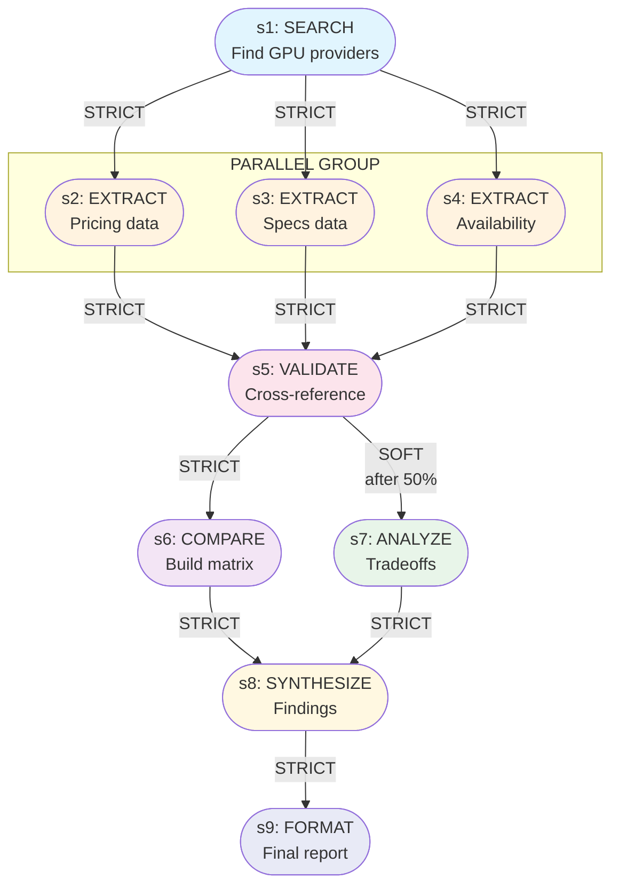
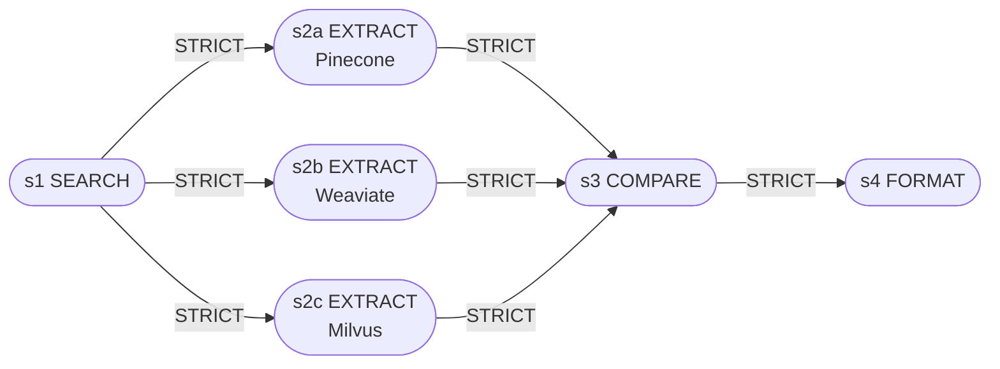

# Deep Research Skill — Decomposition Guide

> **Version:** 1.0
> **Purpose:** Правила разбиения сложных исследовательских задач на атомарные subtasks, определения зависимостей и оркестрации их выполнения.
> **Inspired by:** Fintech Discovery Skill (multi-tool pipeline), Life Planning Coach AGENT.MD (heartbeat/checkpoint pattern), Orchestrator pattern (Stage-Gate validation).

---

## Table of Contents

1. [Atomicity Criteria](#1-atomicity-criteria)
2. [Subtask Taxonomy](#2-subtask-taxonomy)
3. [Dependency Types](#3-dependency-types)
4. [Dependency Graph Notation](#4-dependency-graph-notation)
5. [Granularity Heuristics](#5-granularity-heuristics)
6. [Decomposition Patterns](#6-decomposition-patterns)
7. [Checkpoint Structure](#7-checkpoint-structure)

---

## 1. Atomicity Criteria

### 1.1 Что делает subtask "атомарным"

Атомарный subtask — это неделимая единица работы, которая удовлетворяет **всем** критериям ниже:

| Критерий | Описание | Проверочный вопрос |
|----------|----------|-------------------|
| **Single Intent** | Subtask преследует одну цель | "Можно ли описать цель одним глаголом?" |
| **Single Domain** | Работа в рамках одного источника/домена | "Нужно ли переключаться между инструментами?" |
| **Deterministic Output** | Результат проверяем и имеет чёткую структуру | "Могу ли я написать JSON-schema для результата?" |
| **No Internal Branches** | Внутри subtask нет условных переходов | "Есть ли if/else в логике выполнения?" |
| **Bounded Scope** | Границы входных данных и ожидаемого результата чётко определены | "Я знаю, когда subtask закончен?" |

### 1.2 Max Duration для Atomic Subtask

```
┌─────────────────────────────────────────────────────────┐
│  HARD LIMIT: 15 минут wall-clock time                   │
│  SOFT TARGET: 5-10 минут                               │
│  WARNING:    >10 минут → требуется ревью на атомарность │
└─────────────────────────────────────────────────────────┘
```

**Правила:**
- Если инструмент (например, поиск) не отвечает → retry с exponential backoff, max 3 попытки
- Если после 3 retries неуспех → subtask завершается с частичным результатом + флаг `STALL`
- Subtask с `STALL` становится кандидатом на дальнейшее дробление или смену инструмента

### 1.3 Max Output Size для Atomic Subtask

| Параметр | Лимит | Обоснование |
|----------|-------|-------------|
| **Raw text output** | 8,000 tokens (~6K слов) | Помещается в контекст следующего subtask |
| **Structured data (JSON)** | 50 KB | Парсится без потерь, передаётся по сети |
| **Source references** | 20 источников | Предел когнитивной обработки человека |
| **Extracted entities** | 100 записей | Требует chunking для анализа |

**Если лимит превышен:** автоматический split на `subtask_v1`, `subtask_v2` с суффиксами `_chunk_01`, `_chunk_02`.

### 1.4 Критерии, когда НУЖНО дальше разбивать

Признаки, что subtask **НЕ атомарен** и требует декомпозиции:

1. **Multi-verb description** — в описании более одного глагола действия ("найди и проанализируй")
2. **Tool-switching needed** — требуется более одного инструмента для выполнения
3. **Ambiguous endpoint** — невозможно сформулировать чёткий критерий завершения
4. **Output fan-out** — результат пойдёт в >2 независимых downstream subtasks
5. **Domain crossing** — переключение между языками, регионами, типами источников
6. **Temporal dependency** — требует ожидания внешнего события (>30 сек)
7. **Cognitive overload** — описание subtask не помещается в 3 предложения

**Quick-check формула:**
```
IF (verbs > 1) OR (tools > 1) OR (domains > 1) OR (expected_outputs > 1):
    → DECOMPOSE
ELSE:
    → ATOMIC (pending duration/output checks)
```

---

## 2. Subtask Taxonomy

### 2.1 Типы Subtasks

Каждый subtask в Deep Research Skill **обязан** иметь тип из таблицы ниже. Тип определяет допустимые инструменты, ожидаемый output format и валидаторы.

| Type | Purpose | Инструменты | Output Format | Валидатор |
|------|---------|-------------|---------------|-----------|
| **SEARCH** | Поиск источников | web_search, database_query, api_call | `SearchResult[]` — массив источников с metadata | ≥1 релевантный источник |
| **EXTRACT** | Извлечение данных из источника | firecrawl, curl_cffi, browser, pdf_parser | `ExtractedData` — структурированные данные | completeness ratio ≥ 80% |
| **ANALYZE** | Анализ собранных данных | code_interpreter, llm_reasoning | `Analysis` — инсайты, паттерны, аномалии | ≥1 non-obvious insight |
| **COMPARE** | Сравнение вариантов/источников | code_interpreter, table_generator | `ComparisonMatrix` — таблица с критериями | все критерии заполнены |
| **SYNTHESIZE** | Синтез инсайтов из множества источников | llm_reasoning, knowledge_graph | `Synthesis` — связанные инсайты, гипотезы | coverage ≥ 90% источников |
| **VALIDATE** | Проверка фактов и cross-reference | web_search, fact_checker | `ValidationReport` — confirmed/disputed/unverified | cross-reference ≥ 2 источников |
| **FORMAT** | Форматирование вывода | markdown_renderer, chart_generator | `FormattedOutput` — готовый артефакт | соответствует template |
| **META** | Оркестрация других subtasks | planner, dependency_resolver | `ExecutionPlan` — DAG subtasks | нет циклов, все зависимости разрешимы |

### 2.2 Детальное описание каждого типа

#### SEARCH

```yaml
type: SEARCH
description: "Найти первичные источники по теме X"
inputs:
  - query: string           # Поисковый запрос
  - source_types: []        # [web, academic, news, patent, regulatory]
  - max_results: int        # default: 10
  - recency_days: int       # optional: фильтр по свежести
  - language: []            # preferred languages
outputs:
  - sources:
      - url: string
      - title: string
      - snippet: string
      - source_type: enum
      - relevance_score: float  # 0.0-1.0
      - date: iso_date
tools_allowed: [web_search, database_query, api_call]
max_duration: 5 min
```

**Когда использовать:**
- Первичное исследование темы
- Поиск альтернативных источников для VALIDATE
- Пополнение корпуса данных для SYNTHESIZE

**Когда НЕ использовать:**
- Для извлечения данных (используй EXTRACT)
- Для анализа (используй ANALYZE)

#### EXTRACT

```yaml
type: EXTRACT
description: "Извлечь структурированные данные из источника"
inputs:
  - source: SearchResult    # Результат SEARCH
  - extraction_schema: json # JSON Schema желаемого output
  - method: enum            # [full_page, structured, semantic, screenshot]
outputs:
  - extracted_data: json    # Данные по заданной schema
  - raw_text: string        # Полный текст (fallback)
  - extraction_quality: float  # 0.0-1.0 completeness
tools_allowed: [firecrawl, curl_cffi, browser, pdf_parser]
max_duration: 10 min
```

**Pipeline Fintech Discovery (интеграция):**
```
SOURCE_TYPE_DETECT:
  static/simple    → curl_cffi (быстрый HTTP)
  JS-rendered      → Obscura (headless browser)
  protected/WAF    → CloakBrowser (stealth)
  high-value/doc   → Firecrawl (rich extraction)
```

#### ANALYZE

```yaml
type: ANALYZE
description: "Проанализировать данные и выявить паттерны"
inputs:
  - data: ExtractedData[]   # Данные от одного или многих EXTRACT
  - analysis_type: enum     # [trend, correlation, anomaly, causal, thematic]
  - depth: enum             # [descriptive, diagnostic, predictive, prescriptive]
outputs:
  - insights: Insight[]     # Структурированные инсайты
  - confidence: float       # 0.0-1.0
  - supporting_evidence: [] # Ссылки на данные
tools_allowed: [code_interpreter, llm_reasoning]
max_duration: 10 min
```

#### COMPARE

```yaml
type: COMPARE
description: "Сравнить N вариантов по M критериям"
inputs:
  - items: []               # Сущности для сравнения
  - criteria: []            # Критерии сравнения
  - weights: {}             # optional: веса критериев
outputs:
  - matrix: ComparisonMatrix
  - ranking: RankedItem[]
  - tradeoffs: string       # Описание ключевых компромиссов
tools_allowed: [code_interpreter, table_generator]
max_duration: 8 min
```

#### SYNTHESIZE

```yaml
type: SYNTHESIZE
description: "Синтезировать инсайты из множества источников"
inputs:
  - insights: Insight[]     # Из ANALYZE или COMPARE
  - sources: Source[]       # Оригинальные источники
  - synthesis_goal: string  # Что должно получиться
outputs:
  - synthesis: Synthesis    # Связанная картина
  - hypotheses: Hypothesis[]
  - gaps: Gap[]             # Пробелы в знаниях
tools_allowed: [llm_reasoning, knowledge_graph]
max_duration: 10 min
```

#### VALIDATE

```yaml
type: VALIDATE
description: "Проверить факты через cross-reference"
inputs:
  - claims: Claim[]         # Утверждения для проверки
  - min_sources: int        # default: 2
outputs:
  - report: ValidationReport
      - confirmed: Claim[]
      - disputed: Claim[]   # С конфликтующими источниками
      - unverified: Claim[] # Недостаточно данных
tools_allowed: [web_search, fact_checker]
max_duration: 8 min
```

#### FORMAT

```yaml
type: FORMAT
description: "Привести результат к требуемому формату"
inputs:
  - content: any            # Данные для форматирования
  - template: enum          # [markdown_report, executive_summary, 
                            #  comparison_table, timeline, bibliography]
outputs:
  - formatted: FormattedOutput
tools_allowed: [markdown_renderer, chart_generator]
max_duration: 5 min
```

#### META

```yaml
type: META
description: "Спланировать и оркестрировать выполнение subtasks"
inputs:
  - goal: string            # Исследовательская цель
  - constraints: {}          # Время, бюджет, глубина
outputs:
  - plan: ExecutionPlan
      - subtasks: Subtask[]
      - dependencies: Dependency[]
      - estimated_duration: int
      - checkpoints: Checkpoint[]
tools_allowed: [planner, dependency_resolver]
max_duration: 3 min
```

### 2.3 Типовые цепочки (Subtask Chains)

```
Цепочка исследования одного источника:
  SEARCH → EXTRACT → VALIDATE

Цепочка сравнительного анализа:
  SEARCH×N → EXTRACT×N → COMPARE → FORMAT

Цепочка глубокого исследования:
  META → SEARCH → EXTRACT → ANALYZE → SYNTHESIZE → VALIDATE → FORMAT

Цепочка быстрого ответа (simple query):
  SEARCH → EXTRACT → FORMAT
```

---

## 3. Dependency Types

### 3.1 Полная матрица типов зависимостей

| Type | Semantics | Конкурентный аналог | Визуальный маркер |
|------|-----------|---------------------|-------------------|
| **STRICT** | B нельзя начать без полного завершения A | Stage-Gate (hard gate) | `A ──► B` (сплошная стрелка) |
| **SOFT** | B может начать с partial output от A | Concurrent Engineering | `A ──► B` (пунктирная стрелка) |
| **NONE** | A и B полностью независимы | Parallel Processing | `A  B` (нет связи) |
| **FEEDBACK** | Результат B влияет на продолжение A | Agile/Scrum Feedback | `A ◄──► B` (двунаправленная) |

### 3.2 Детальные спецификации

#### STRICT (`A ──► B`)

```
Свойства:
  - B.start_after: A.status == "completed"
  - B.input_requires: A.output (полный, validated)
  - Rollback: если A фейлится, B не запускается, весь pipeline STOP
  - Use case: EXTRACT после SEARCH (нужны URL), VALIDATE после EXTRACT

Строгость:
  - HARD STRICT: B физически не может работать без A (нужны данные)
  - SOFT STRICT: B может работать но результат бессмысленен без A
```

#### SOFT (`A - -► B`)

```
Свойства:
  - B.start_after: A.status IN ["running", "completed"]
  - B.input_requires: A.partial_output (streamable)
  - Rollback: B обновляется при новых данных от A
  - Use case: ANALYZE начинается после первых EXTRACT, 
              FORMAT шаблон готовится пока идёт SYNTHESIZE

Условия активации:
  - MIN_PROGRESS: A.output_size >= threshold (например, 30%)
  - FIRST_RESULT: A.output.length >= 1
  - STREAM_READY: A.supports_streaming == true
```

#### NONE (`A  B`)

```
Свойства:
  - A и B запускаются параллельно
  - Нет shared state (идеально)
  - Результаты мержатся на уровне downstream subtask
  - Use case: SEARCH по разным query, EXTRACT из независимых источников

Ограничения:
  - Max parallel: по умолчанию 5 subtasks одновременно
  - Rate limits: учитывать лимиты API при параллелизме
```

#### FEEDBACK (`A ◄──► B`)

```
Свойства:
  - B запускается после частичного завершения A
  - Результат B направляется обратно в A (continuation)
  - A может породить A' (итерация)
  - Use case: SEARCH ↔ VALIDATE (поиск доп.источников для 
              неподтверждённых фактов), ANALYZE ↔ SYNTHESIZE

Модели feedback:
  Model A — Simple Loop:
    A produces output → B validates → if gaps found → A continues
  
  Model B — Iterative Refinement:
    A.v1 → B.feedback → A.v2 → B.feedback → ... → converge
  
  Model C — Bidirectional (rare):
    A и B работают concurrently, обмениваясь промежуточными результатами

Max iterations: 3 (по умолчанию), после — escalation к META.
```

### 3.3 Матрица допустимых комбинаций типов subtasks и dependencies

```
              STRICT    SOFT      NONE      FEEDBACK
SEARCH ──►    EXTRACT   ANALYZE   SEARCH    SEARCH (refinement)
EXTRACT ──►   VALIDATE  ANALYZE   EXTRACT   EXTRACT (deep dive)
ANALYZE ──►   SYNTHESIZE COMPARE  ANALYZE   ANALYZE (re-analysis)
COMPARE ──►   FORMAT    SYNTHESIZE -        COMPARE (add criteria)
SYNTHESIZE ──► FORMAT    -         -         SYNTHESIZE (new sources)
VALIDATE ──►  SYNTHESIZE SEARCH    -         VALIDATE (re-check)
META ──►      ALL       -         -         META (re-plan)
```

**Правило:** FEEDBACK допустим только между subtasks **одного типа** или к META.


---

## 4. Dependency Graph Notation

### 4.1 Текстовый формат (DRGN — Deep Research Graph Notation)

Формат для машинной записи и человекочитаемого описания графа зависимостей.

```
TASK <task_id> {
  name: "<human-readable name>"
  goal: "<what we want to achieve>"
  
  SUBTASK <sub_id> {
    type: <SEARCH|EXTRACT|ANALYZE|COMPARE|SYNTHESIZE|VALIDATE|FORMAT|META>
    name: "<short name>"
    description: "<what this subtask does>"
    estimated_duration: <minutes>
    output_schema: <reference to schema>
    
    DEPENDS_ON {
      <parent_id>: STRICT
      <parent_id>: SOFT [after: <condition>]
      <parent_id>: FEEDBACK [max_iterations: <N>]
    }
    
    TOOLS: [<tool1>, <tool2>]
    CHECKPOINT: <checkpoint_id>
  }
  
  PARALLEL_GROUP <group_id> {
    members: [<sub_id1>, <sub_id2>, ...]
    max_concurrent: <N>
    merge_strategy: <all|any|first_n>
  }
}
```

### 4.2 Пример текстового описания: "Competitive Landscape Analysis"

```
TASK comp_landscape_001 {
  name: "Competitive Landscape: Cloud GPU Providers"
  goal: "Map and compare top 5 cloud GPU providers by pricing, performance, availability"
  
  SUBTASK s1 {
    type: SEARCH
    name: "Find GPU providers"
    description: "Search for top cloud GPU providers 2024-2025"
    estimated_duration: 5
    DEPENDS_ON: {}
    CHECKPOINT: cp_01_raw
  }
  
  SUBTASK s2 {
    type: EXTRACT
    name: "Extract pricing data"
    description: "Extract pricing pages from provider websites"
    DEPENDS_ON: { s1: STRICT }
    CHECKPOINT: cp_01_raw
  }
  
  SUBTASK s3 {
    type: EXTRACT
    name: "Extract specs data"
    description: "Extract GPU specifications and performance metrics"
    DEPENDS_ON: { s1: STRICT }
    CHECKPOINT: cp_01_raw
  }
  
  SUBTASK s4 {
    type: EXTRACT
    name: "Extract availability"
    description: "Extract region availability and uptime data"
    DEPENDS_ON: { s1: STRICT }
    CHECKPOINT: cp_01_raw
  }
  
  PARALLEL_GROUP pg1 {
    members: [s2, s3, s4]
    max_concurrent: 3
    merge_strategy: all
  }
  
  SUBTASK s5 {
    type: VALIDATE
    name: "Validate extracted data"
    description: "Cross-reference pricing and specs"
    DEPENDS_ON: { s2: STRICT, s3: STRICT, s4: STRICT }
    CHECKPOINT: cp_02_processed
  }
  
  SUBTASK s6 {
    type: COMPARE
    name: "Compare providers"
    description: "Build comparison matrix across all criteria"
    DEPENDS_ON: { s5: STRICT }
    CHECKPOINT: cp_03_draft
  }
  
  SUBTASK s7 {
    type: ANALYZE
    name: "Analyze tradeoffs"
    description: "Identify key tradeoffs and differentiators"
    DEPENDS_ON: { s5: SOFT [after: "50% of sources validated"] }
    CHECKPOINT: cp_03_draft
  }
  
  SUBTASK s8 {
    type: SYNTHESIZE
    name: "Synthesize findings"
    description: "Create coherent narrative from comparison and analysis"
    DEPENDS_ON: { s6: STRICT, s7: STRICT }
    CHECKPOINT: cp_04_reviewed
  }
  
  SUBTASK s9 {
    type: FORMAT
    name: "Format report"
    description: "Generate final markdown report"
    DEPENDS_ON: { s8: STRICT }
    CHECKPOINT: final
  }
}
```

### 4.3 Визуальная нотация: ASCII

```
[Competitive Landscape: Cloud GPU Providers]

                    ┌─────────┐
                    │   s1    │
                    │ SEARCH  │
                    │Providers│
                    └────┬────┘
                         │ STRICT
           ┌─────────────┼─────────────┐
           ▼             ▼             ▼
      ┌─────────┐  ┌─────────┐  ┌─────────┐
      │   s2    │  │   s3    │  │   s4    │
      │ EXTRACT │  │ EXTRACT │  │ EXTRACT │
      │ Pricing │  │  Specs  │  │Regions  │
      └────┬────┘  └────┬────┘  └────┬────┘
           │            │            │
           └────────────┼────────────┘
                        ▼ STRICT
                   ┌─────────┐
                   │   s5    │
                   │VALIDATE │
                   │  Data   │
                   └────┬────┘
                        │
           ┌────────────┤
           ▼ STRICT     ▼ SOFT (after 50%)
      ┌─────────┐  ┌─────────┐
      │   s6    │  │   s7    │
      │ COMPARE │  │ ANALYZE │
      │Providers│  │Tradeoffs│
      └────┬────┘  └────┬────┘
           │            │
           └────────────┤
                        ▼ STRICT
                   ┌─────────┐
                   │   s8    │
                   │SYNTHESIZE
                   │Findings │
                   └────┬────┘
                        │ STRICT
                        ▼
                   ┌─────────┐
                   │   s9    │
                   │ FORMAT  │
                   │ Report  │
                   └─────────┘

PARALLEL: s2 || s3 || s4 (group pg1)
```

### 4.4 Визуальная нотация: Mermaid



### 4.5 Примеры графов для разных типов задач

#### Пример A: Technology Deep Dive (линейная цепочка с параллельным поиском)

```
ASCII:

  ┌──────────┐     ┌──────────┐     ┌──────────┐
  │ s1SEARCH │     │ s2SEARCH │     │ s3SEARCH │
  │ Academic │     │  Vendor  │     │  GitHub  │
  │ Papers   │     │  Docs    │     │  Repos   │
  └────┬─────┘     └────┬─────┘     └────┬─────┘
       │                │                │
       └────────────────┼────────────────┘
                        ▼ STRICT
                   ┌──────────┐
                   │ s4EXTRACT│
                   │ Key Info │
                   └────┬─────┘
                        ▼ STRICT
                   ┌──────────┐
                   │ s5ANALYZE│
                   │ Patterns │
                   └────┬─────┘
                        ▼ FEEDBACK (max 3)
                   ┌──────────┐
                   │ s6VALIDATE
                   │  Claims  │────┐
                   └────┬─────┘    │ (if gaps)
                        │          │
                        ▼ STRICT   │
                   ┌──────────┐    │
                   │ s7SYNTHES│◄───┘
                   │  ize     │
                   └────┬─────┘
                        ▼ STRICT
                   ┌──────────┐
                   │ s8FORMAT │
                   │  Report  │
                   └──────────┘

Mermaid:
graph TD
    S1([s1: SEARCH<br/>Academic]) -->|STRICT| S4
    S2([s2: SEARCH<br/>Vendor docs]) -->|STRICT| S4
    S3([s3: SEARCH<br/>GitHub]) -->|STRICT| S4
    S4([s4: EXTRACT<br/>Key info]) -->|STRICT| S5
    S5([s5: ANALYZE<br/>Patterns]) -->|STRICT| S6
    S6([s6: VALIDATE]) -->|STRICT| S7
    S6 -.->|FEEDBACK<br/>if gaps| S5
    S7([s7: SYNTHESIZE]) -->|STRICT| S8
    S8([s8: FORMAT])
```

#### Пример B: Market Sizing (ветвящаяся структура)

```
  ┌──────────┐
  │ s1SEARCH │
  │ TAM/SAM  │
  └────┬─────┘
       │ STRICT
       ▼
  ┌──────────┐     ┌──────────┐     ┌──────────┐
  │ s2EXTRACT│     │ s3EXTRACT│     │ s4EXTRACT│
  │ Top-Down │     │Bottom-Up │     │  Analyst │
  │  Data    │     │  Data    │     │ Reports  │
  └────┬─────┘     └────┬─────┘     └────┬─────┘
       │                │                │
       └────────────────┼────────────────┘
                        ▼ STRICT
                   ┌──────────┐
                   │ s5ANALYZE│
                   │ Triangul-│
                   │   ation  │
                   └────┬─────┘
                        ▼ STRICT
                   ┌──────────┐
                   │ s6COMPARE│
                   │ Methods  │
                   └────┬─────┘
                        ▼ STRICT
                   ┌──────────┐
                   │ s7FORMAT │
                   │  Model   │
                   └──────────┘
```

#### Пример C: Academic Literature Review (SOFT-зависимости для инкрементальности)

```
  ┌──────────┐     ┌──────────┐     ┌──────────┐
  │ s1SEARCH │     │ s2SEARCH │     │ s3SEARCH │
  │  PubMed  │     │  arXiv   │     │ IEEE Xplore
  │ Query A  │     │ Query B  │     │ Query C  │
  └────┬─────┘     └────┬─────┘     └────┬─────┘
       │ NONE           │ NONE           │ NONE
       ▼                ▼                ▼
  ┌──────────┐     ┌──────────┐     ┌──────────┐
  │ s4EXTRACT│     │ s5EXTRACT│     │ s6EXTRACT│
  │ Abstracts│     │ Abstracts│     │ Abstracts│
  └────┬─────┘     └────┬─────┘     └────┬─────┘
       │                │                │
       └────────────────┼────────────────┘
                        ▼ SOFT (each extract triggers)
                   ┌──────────┐
                   │ s7ANALYZE│◄──────────────────┐
                   │ Thematic │                    │
                   │ Analysis │                    │ FEEDBACK
                   └────┬─────┘                    │ (add sources
                        ▼ STRICT                    │  for gaps)
                   ┌──────────┐                    │
                   │ s8SYNTHES│────────────────────┘
                   │  IZE     │
                   │  Review  │
                   └────┬─────┘
                        ▼ STRICT
                   ┌──────────┐
                   │ s9FORMAT │
                   │ Biblio+  │
                   │  Synthesis
                   └──────────┘
```

---

## 5. Granularity Heuristics

### 5.1 По сложности задачи

```
┌─────────────────────────────────────────────────────────────────────┐
│                         COMPLEXITY MATRIX                           │
├─────────────┬─────────────────┬─────────────────┬───────────────────┤
│  Simple     │   Medium        │   Complex       │   Wicked          │
│  (1-2 hrs)  │   (2-8 hrs)     │   (1-3 days)    │   (3+ days)       │
├─────────────┼─────────────────┼─────────────────┼───────────────────┤
│ 3-7 subtasks│  8-20 subtasks  │  20-50 subtasks │  50+ subtasks     │
│ 1-2 levels  │  2-3 levels     │  3-5 levels     │  5+ levels        │
│ 1 META      │  1-2 META       │  2-5 META       │  5+ META          │
│ No feedback │  1-2 feedback   │  3-5 feedback   │  5+ feedback loops│
│ loops       │  loops          │  loops          │                   │
├─────────────┼─────────────────┼─────────────────┼───────────────────┤
│ Quick check │  Standard       │  Deep research  │  Research program │
│ Known domain│  Investigation  │  New domain     │  Fundamental      │
│ 1-2 sources │  Multiple       │  Multi-method   │  uncertainty    │
│             │  perspectives   │  Cross-validated│  Stakeholder      │
│             │                 │                 │  dependent        │
└─────────────┴─────────────────┴─────────────────┴───────────────────┘
```

**Классификация задачи по признакам:**

| Признак | Simple | Medium | Complex | Wicked |
|---------|--------|--------|---------|--------|
| Понятность вопроса | Полная | В основном | Размытая | Не определена |
| Доступность данных | Открытая | Частично ограничена | Ограничена | Конфликтующая |
| Количество доменов | 1 | 1-2 | 3-5 | 5+ |
| Временной горизонт | Текущий | 1-2 года | 3-5 лет | Десятилетия |
| Количество stakeholder'ов | 1 | 2-3 | 3-5 | 5+ |
| Наличие аналогов | Много | Некоторые | Редкие | Уникальна |

### 5.2 По доступному времени

```
Time Budget → Granularity Mapping:

  < 1 час:    Максимальное агрегирование
              - Использовать pre-synthesized sources (Wikipedia, обзоры)
              - SKIP: VALIDATE (кроме критичных фактов)
              - MERGE: ANALYZE + SYNTHESIZE в один subtask
              - MAX: 5 subtasks

  1-4 часа:   Стандартная декомпозиция
              - Все типы subtasks, но сжатые
              - MAX: 15 subtasks
              - Один уровень параллелизма

  4-24 часа:  Полная декомпозиция
              - Все типы subtasks в полном объёме
              - MAX: 40 subtasks
              - Многоуровневый параллелизм

  > 24 часа:  Исследовательский режим
              - Глубокая декомпозиция
              - Неограниченное число subtasks
              - Iterative refinement с feedback loops
              - Checkpoint после КАЖДОГО major stage
```

### 5.3 По доступному бюджету (API calls / compute)

```
┌─────────────────────────────────────────────────────────────────┐
│ BUDGET TIER          │  STRATEGY                                │
├─────────────────────────────────────────────────────────────────┤
│ FREE / Minimal       │  - SEARCH: 3-5 queries max               │
│ ($0-5)               │  - EXTRACT: ручной выбор источников      │
│                      │  - SKIP: VALIDATE (sample only)          │
│                      │  - ANALYZE: LLM-only, no code interp     │
│                      │  - Итераций FEEDBACK: 0                │
├─────────────────────────────────────────────────────────────────┤
│ STANDARD             │  - SEARCH: 10-20 queries                 │
│ ($5-25)              │  - EXTRACT: автоматический crawl         │
│                      │  - VALIDATE: ключевые факты              │
│                      │  - ANALYZE: code + LLM                   │
│                      │  - FEEDBACK: 1-2 цикла                  │
├─────────────────────────────────────────────────────────────────┤
│ PREMIUM              │  - SEARCH: 50+ queries                   │
│ ($25-100)            │  - EXTRACT: Firecrawl для всех           │
│                      │  - VALIDATE: полный cross-reference      │
│                      │  - ANALYZE: advanced stats + viz         │
│                      │  - FEEDBACK: 3+ цикла                   │
├─────────────────────────────────────────────────────────────────┤
│ ENTERPRISE           │  - SEARCH: неограниченно                 │
│ ($100+)              │  - EXTRACT: все доступные инструменты    │
│                      │  - VALIDATE: мульти-источниковая         │
│                      │  - ANALYZE: custom models                │
│                      │  - FEEDBACK: до сходимости              │
└─────────────────────────────────────────────────────────────────┘
```

### 5.4 По требуемой глубине

```
DEPTH LEVELS:

L1 — Surface (Executive Summary):
  - 1-2 источника на claim
  - No primary sources required
  - SYNTHESIZE только очевидные инсайты
  - Max subtasks: 5-8

L2 — Standard (Analytical Report):
  - 2-3 источника на claim
  - Mix primary & secondary
  - ANALYZE с code_interpreter
  - VALIDATE ключевые факты
  - Max subtasks: 15-25

L3 — Deep (Research Paper Quality):
  - 3-5 источника на claim
  - Primary sources preferred
  - Full ANALYZE + COMPARE pipeline
  - Complete VALIDATE
  - 2-3 FEEDBACK iterations
  - Max subtasks: 30-50

L4 — Exhaustive (Thesis / Monograph):
  - 5+ источников на claim
  - Primary sources required
  - Multi-method ANALYZE
  - Exhaustive VALIDATE
  - FEEDBACK до сходимости
  - Meta-analysis включён
  - Max subtasks: 50+
```

### 5.5 Алгоритм выбора гранулярности

```python
def determine_granularity(task_profile):
    """
    task_profile = {
        'complexity': 'simple' | 'medium' | 'complex' | 'wicked',
        'time_budget_hours': float,
        'budget_usd': float,
        'depth_level': 1 | 2 | 3 | 4,
        'domain_familiarity': 'known' | 'partial' | 'unknown'
    }
    """
    
    # Base from complexity
    base_subtasks = {
        'simple': 5, 'medium': 15, 
        'complex': 35, 'wicked': 60
    }
    n = base_subtasks[task_profile['complexity']]
    
    # Adjust for time
    time_adj = {
        (0, 1): 0.3, (1, 4): 0.7, 
        (4, 24): 1.0, (24, 999): 1.5
    }
    for (low, high), factor in time_adj.items():
        if low <= task_profile['time_budget_hours'] < high:
            n *= factor
            break
    
    # Adjust for budget
    budget_adj = {
        (0, 5): 0.5, (5, 25): 0.8,
        (25, 100): 1.0, (100, 9999): 1.5
    }
    for (low, high), factor in budget_adj.items():
        if low <= task_profile['budget_usd'] < high:
            n *= factor
            break
    
    # Adjust for depth
    depth_mult = {1: 0.5, 2: 1.0, 3: 1.5, 4: 2.0}
    n *= depth_mult[task_profile['depth_level']]
    
    # Adjust for familiarity
    fam_mult = {'known': 0.7, 'partial': 1.0, 'unknown': 1.3}
    n *= fam_mult[task_profile['domain_familiarity']]
    
    return {
        'recommended_subtasks': int(n),
        'max_depth_levels': min(5, int(n / 8) + 1),
        'checkpoint_frequency': 'every_stage' if n > 20 else 'final_only',
        'feedback_loops': 0 if n < 10 else min(3, int(n / 15))
    }
```


---

## 6. Decomposition Patterns

> **Паттерн** = типовая структура subtasks + их типы + зависимости для класса исследовательских задач. Паттерны наследуют Atomicity Criteria, используют Subtask Taxonomy и комбинируют Dependency Types.

### 6.0 Template для описания паттерна

Каждый паттерн описывается по шаблону:

```
PATTERN: <Name>
Trigger: <как понять, что задача соответствует паттерну>
Typical Complexity: Simple | Medium | Complex | Wicked
Typical Duration: <часы/дни>
Subtask Count: <диапазон>

Structure:
  [ASCII graph]

Phases:
  1. <Phase Name>: <subtasks>
  2. ...

Checkpoint Map:
  cp_XX_<name> → после какого этапа

Adaptations:
  - <как адаптировать под разные условия>
```

---

### 6.1 Pattern: "Competitive Landscape"

**Trigger:** Запрос на сравнение компаний/продуктов/решений в одном пространстве.

| Параметр | Значение |
|----------|----------|
| Typical Complexity | Medium |
| Typical Duration | 2-6 часов |
| Subtask Count | 12-25 |

#### Structure

```
PHASE 1 — UNIVERSE DEFINITION ( Who's playing? )
┌────────────────────────────────────────────────────┐
│ s1.SEARCH: Identify market segment & criteria      │
│ s2.SEARCH: Find all major players (top 10-15)      │
│ s3.ANALYZE: Prioritize & select top 5-7 for deep   │
│        analysis (relevance scoring)                │
└────────────────────────────────────────────────────┘
         │
         ▼ cp_01_raw
PHASE 2 — PARALLEL EXTRACTION ( Gather intelligence )
┌────────────────────────────────────────────────────┐
│ PARALLEL for each selected player:                 │
│   s4_i.SEARCH: Company-specific deep search        │
│   s5_i.EXTRACT: Product features                   │
│   s6_i.EXTRACT: Pricing information                │
│   s7_i.EXTRACT: Customer reviews/sentiment         │
│   s8_i.EXTRACT: Funding, team, traction            │
└────────────────────────────────────────────────────┘
         │ (all complete)
         ▼ cp_02_processed
PHASE 3 — VALIDATION ( Ensure data quality )
┌────────────────────────────────────────────────────┐
│ s9.VALIDATE: Cross-check pricing across sources    │
│ s10.VALIDATE: Verify company claims vs reality     │
└────────────────────────────────────────────────────┘
         │
         ▼ cp_02_processed (validated)
PHASE 4 — ANALYSIS & COMPARISON ( Make sense )
┌────────────────────────────────────────────────────┐
│ s11.COMPARE: Feature matrix across all players     │
│ s12.COMPARE: Pricing comparison (normalized)       │
│ s13.ANALYZE: Market positioning (quadrants)        │
│ s14.ANALYZE: Strengths/weaknesses per player       │
└────────────────────────────────────────────────────┘
         │
         ▼ cp_03_draft
PHASE 5 — SYNTHESIS ( Tell the story )
┌────────────────────────────────────────────────────┐
│ s15.SYNTHESIZE: Market narrative & trends          │
│ s16.SYNTHESIZE: Strategic implications             │
│ s17.ANALYZE: White space / opportunity gaps        │
└────────────────────────────────────────────────────┘
         │
         ▼ cp_04_reviewed
PHASE 6 — DELIVERY ( Package it )
┌────────────────────────────────────────────────────┐
│ s18.FORMAT: Comparison tables (sortable)           │
│ s19.FORMAT: Executive summary (1-pager)            │
│ s20.FORMAT: Full report with visualizations        │
└────────────────────────────────────────────────────┘
         │
         ▼ final
```

#### Checkpoint Map

| Checkpoint | After Phase | Артефакты |
|------------|-------------|-----------|
| `cp_01_raw` | Phase 1 | Player shortlist with relevance scores |
| `cp_02_processed` | Phase 2+3 | Validated data dossier per player (5-7 dossiers) |
| `cp_03_draft` | Phase 4 | Comparison matrices, positioning maps |
| `cp_04_reviewed` | Phase 5 | Strategic narrative, opportunity analysis |
| `final` | Phase 6 | Formatted deliverables bundle |

#### Adaptations

- **< 1 час:** Фазы 1-2 сжаты, Фаза 3 (VALIDATE) — sample, Фазы 4-5 merge
- **> 8 часов:** Добавить `s_i.MONITOR` для отслеживания изменений, глубже `s_i.ANALYZE` с финансовым моделированием
- **Enterprise focus:** Добавить EXTRACT: security certifications, compliance, case studies

---

### 6.2 Pattern: "Technology Deep Dive"

**Trigger:** Запрос на понимание технологии, архитектуры, протокола или технического подхода.

| Параметр | Значение |
|----------|----------|
| Typical Complexity | Medium-Complex |
| Typical Duration | 3-10 часов |
| Subtask Count | 15-35 |

#### Structure

```
PHASE 1 — SOURCE MAPPING ( Where is knowledge? )
┌────────────────────────────────────────────────────┐
│ s1.SEARCH: Academic papers (Google Scholar, arXiv) │
│ s2.SEARCH: Official documentation & specs          │
│ s3.SEARCH: Technical blogs & implementation posts  │
│ s4.SEARCH: GitHub repos & reference implementations  │
│ s5.SEARCH: Community discussions (HN, Reddit, SO)  │
│ s6.ANALYZE: Source quality ranking & selection      │
└────────────────────────────────────────────────────┘
         │
         ▼ cp_01_raw
PHASE 2 — EXTRACTION ( Get the content )
┌────────────────────────────────────────────────────┐
│ PARALLEL by source type:                           │
│   s7.EXTRACT: Core concepts & definitions          │
│   s8.EXTRACT: Architecture diagrams & flows        │
│   s9.EXTRACT: Code examples & APIs                 │
│   s10.EXTRACT: Performance benchmarks              │
│   s11.EXTRACT: Limitations & known issues          │
│   s12.EXTRACT: Version history & changelog         │
└────────────────────────────────────────────────────┘
         │
         ▼ cp_02_processed
PHASE 3 — ANALYSIS ( Understand deeply )
┌────────────────────────────────────────────────────┐
│ s13.ANALYZE: How it works (step-by-step)           │
│ s14.ANALYZE: Design decisions & tradeoffs          │
│ s15.COMPARE: vs alternative approaches               │
│ s16.ANALYZE: Performance characteristics           │
│ s17.ANALYZE: Security considerations               │
│ s18.VALIDATE: Technical accuracy of claims         │
│        │                                           │
│        └──────► FEEDBACK LOOP (max 3) ◄────────────┤
│                  если найдены несостыковки          │
└────────────────────────────────────────────────────┘
         │
         ▼ cp_03_draft
PHASE 4 — SYNTHESIS ( Build coherent understanding )
┌────────────────────────────────────────────────────┐
│ s19.SYNTHESIZE: Unified technical explanation      │
│ s20.SYNTHESIZE: Best practices & patterns          │
│ s21.SYNTHESIZE: When to use / when NOT to use      │
│ s22.SYNTHESIZE: Future roadmap & evolution         │
└────────────────────────────────────────────────────┘
         │
         ▼ cp_04_reviewed
PHASE 5 — DELIVERY ( Communicate )
┌────────────────────────────────────────────────────┐
│ s23.FORMAT: Technical primer (for engineers)       │
│ s24.FORMAT: Architecture diagrams (Mermaid)        │
│ s25.FORMAT: Decision matrix (adoption guide)       │
│ s26.FORMAT: Executive summary (for non-tech)       │
└────────────────────────────────────────────────────┘
         │
         ▼ final
```

#### Fintech Discovery Integration (инструменты по этапам)

```
Источник типа          → Инструмент
─────────────────────────────────────────
Static docs/API ref    → curl_cffi (быстрый, лёгкий)
JS-heavy docs portal   → Obscura (headless, рендерит JS)
Cloudflare/WAF защита  → CloakBrowser (stealth mode)
Высокоценный контент   → Firecrawl (rich extraction, markdown)
Неопределённо          → curl_cffi fallback → escalate
```

#### Checkpoint Map

| Checkpoint | After Phase | Артефакты |
|------------|-------------|-----------|
| `cp_01_raw` | Phase 1 | Список источников с quality score |
| `cp_02_processed` | Phase 2 | Структурированные технические данные |
| `cp_03_draft` | Phase 3 | Технический анализ, validated claims |
| `cp_04_reviewed` | Phase 4 | Полное техническое понимание в виде narrative |
| `final` | Phase 5 | Документы для разных аудиторий |

---

### 6.3 Pattern: "Market Sizing"

**Trigger:** Запрос на оценку размера рынка (TAM/SAM/SOM), прогноз роста, addressable market.

| Параметр | Значение |
|----------|----------|
| Typical Complexity | Medium-Complex |
| Typical Duration | 4-12 часов |
| Subtask Count | 18-30 |

#### Structure

```
PHASE 1 — METHODOLOGY SELECTION ( How to size? )
┌────────────────────────────────────────────────────┐
│ s1.SEARCH: Existing market research reports        │
│ s2.SEARCH: Industry analyst estimates (Gartner,    │
│            IDC, Forrester, McKinsey)               │
│ s3.ANALYZE: Methodology assessment                 │
│        (Top-Down vs Bottom-Up vs Triangulation)    │
│ s4.META: Select primary & secondary methods        │
└────────────────────────────────────────────────────┘
         │
         ▼ cp_01_raw
PHASE 2 — DATA GATHERING ( Multi-method approach )
┌────────────────────────────────────────────────────┐
│ BRANCH A — TOP-DOWN:                                 │
│   s5.SEARCH: Macro-economic indicators               │
│   s6.EXTRACT: GDP, industry value, growth rates      │
│   s7.ANALYZE: Top-down calculation                   │
│                                                      │
│ BRANCH B — BOTTOM-UP:                                │
│   s8.SEARCH: # of customers, ASP, penetration        │
│   s9.EXTRACT: Company filings, pricing data          │
│   s10.ANALYZE: Bottom-up calculation                 │
│                                                      │
│ BRANCH C — COMPARABLES:                              │
│   s11.SEARCH: Analogous markets sizing               │
│   s12.EXTRACT: Proxy market data                     │
│   s13.ANALYZE: Analogical estimation                 │
└────────────────────────────────────────────────────┘
         │ (all branches)
         ▼ cp_02_processed
PHASE 3 — TRIANGULATION ( Cross-validate )
┌────────────────────────────────────────────────────┐
│ s14.COMPARE: Results across all 3 methods          │
│ s15.ANALYZE: Variance analysis & reconciliation    │
│ s16.VALIDATE: Sanity check vs known benchmarks     │
│        (e.g., does TAM < global GDP?)              │
│ s17.ANALYZE: Confidence intervals                  │
└────────────────────────────────────────────────────┘
         │
         ▼ cp_03_draft
PHASE 4 — SEGMENTATION ( Granular breakdown )
┌────────────────────────────────────────────────────┐
│ s18.ANALYZE: Segment by geography                  │
│ s19.ANALYZE: Segment by customer type              │
│ s20.ANALYZE: Segment by use case / vertical        │
│ s21.COMPARE: Growth rates by segment               │
└────────────────────────────────────────────────────┘
         │
         ▼ cp_04_reviewed
PHASE 5 — DELIVERY ( Model + narrative )
┌────────────────────────────────────────────────────┐
│ s22.SYNTHESIZE: Market narrative & key drivers     │
│ s23.FORMAT: TAM/SAM/SOM model (spreadsheet-style)  │
│ s24.FORMAT: Growth forecast with assumptions       │
│ s25.FORMAT: Sensitivity analysis (best/base/worst) │
│ s26.FORMAT: Executive presentation                 │
└────────────────────────────────────────────────────┘
         │
         ▼ final
```

#### Checkpoint Map

| Checkpoint | After Phase | Артефакты |
|------------|-------------|-----------|
| `cp_01_raw` | Phase 1 | Выбранные методологии, список источников |
| `cp_02_processed` | Phase 2 | Сырые расчёты по 3 методам |
| `cp_03_draft` | Phase 3 | Триангулированные оценки с confidence intervals |
| `cp_04_reviewed` | Phase 4 | Сегментированный рынок |
| `final` | Phase 5 | Готовая модель и презентация |

---

### 6.4 Pattern: "Regulatory Analysis"

**Trigger:** Запрос на понимание регуляторной среды, compliance требований, legal рисков.

| Параметр | Значение |
|----------|----------|
| Typical Complexity | Complex |
| Typical Duration | 6-18 часов |
| Subtask Count | 20-40 |

#### Structure

```
PHASE 1 — JURISDICTION MAPPING ( Where does it apply? )
┌────────────────────────────────────────────────────┐
│ s1.SEARCH: Applicable jurisdictions                │
│ s2.SEARCH: Primary regulators & their mandates     │
│ s3.SEARCH: International standards (ISO, IEC, etc) │
│ s4.ANALYZE: Regulatory overlap & hierarchy          │
└────────────────────────────────────────────────────┘
         │
         ▼ cp_01_raw
PHASE 2 — REGULATION EXTRACTION ( What do they say? )
┌────────────────────────────────────────────────────┐
│ PARALLEL per jurisdiction:                           │
│   s5_i.SEARCH: Official regulations & laws           │
│   s6_i.SEARCH: Regulatory guidance & interpretations │
│   s7_i.SEARCH: Enforcement actions & precedents      │
│   s8_i.EXTRACT: Key requirements & obligations       │
│   s9_i.EXTRACT: Penalties & sanctions                │
│   s10_i.EXTRACT: Compliance deadlines & milestones   │
└────────────────────────────────────────────────────┘
         │
         ▼ cp_02_processed
PHASE 3 — ANALYSIS & COMPARISON ( What does it mean? )
┌────────────────────────────────────────────────────┐
│ s11.COMPARE: Cross-jurisdiction requirements        │
│ s12.ANALYZE: Compliance gap analysis               │
│ s13.ANALYZE: Regulatory trends & future changes    │
│ s14.ANALYZE: Impact assessment by business area    │
│ s15.VALIDATE: Legal interpretation accuracy          │
│        (consult secondary legal sources)             │
└────────────────────────────────────────────────────┘
         │
         ▼ cp_03_draft
PHASE 4 — RISK ASSESSMENT ( What are the implications? )
┌────────────────────────────────────────────────────┐
│ s16.ANALYZE: Risk matrix (probability × impact)    │
│ s17.ANALYZE: Scenarios (best / expected / worst)   │
│ s18.SYNTHESIZE: Strategic recommendations          │
│ s19.SYNTHESIZE: Compliance roadmap                 │
└────────────────────────────────────────────────────┘
         │
         ▼ cp_04_reviewed
PHASE 5 — DELIVERY ( Package for legal & business )
┌────────────────────────────────────────────────────┐
│ s20.FORMAT: Regulatory summary by jurisdiction     │
│ s21.FORMAT: Compliance checklist                   │
│ s22.FORMAT: Risk register                          │
│ s23.FORMAT: Implementation roadmap                 │
│ s24.FORMAT: Executive briefing                     │
└────────────────────────────────────────────────────┘
         │
         ▼ final
```

#### Особенности паттерна

- **Критичность VALIDATE:** Всегда cross-reference с ≥2 юридическими источниками
- **FEEDBACK loop:** Phase 3 ↔ Phase 2 если interpretation вызывает сомнения
- **⚠️ Disclaimer:** Артефакт `final` обязан содержать notice: "Not legal advice"

---

### 6.5 Pattern: "Academic Literature Review"

**Trigger:** Запрос на обзор научной литературы по теме, research gaps, state-of-the-art.

| Параметр | Значение |
|----------|----------|
| Typical Complexity | Complex-Wicked |
| Typical Duration | 8-24 часов |
| Subtask Count | 25-50 |

#### Structure

```
PHASE 1 — CORPUS BUILDING ( Find the papers )
┌────────────────────────────────────────────────────┐
│ s1.SEARCH: Academic databases (Scholar, PubMed,    │
│            IEEE, ACM, arXiv, SSRN)                 │
│ s2.SEARCH: Systematic review protocols (PROSPERO)  │
│ s3.SEARCH: Citation networks (forward & backward)  │
│ s4.SEARCH: Grey literature (theses, preprints)     │
│ s5.ANALYZE: Deduplication & relevance filtering    │
│        (PRISMA-style screening)                    │
└────────────────────────────────────────────────────┘
         │
         ▼ cp_01_raw
PHASE 2 — EXTRACTION ( Get the knowledge )
┌────────────────────────────────────────────────────┐
│ BATCHED extraction (by paper clusters):              │
│   s6.EXTRACT: Research questions & hypotheses        │
│   s7.EXTRACT: Methodologies & approaches             │
│   s8.EXTRACT: Key findings & claims                  │
│   s9.EXTRACT: Data & evidence                        │
│   s10.EXTRACT: Limitations & future work             │
│   s11.EXTRACT: Citation counts & impact metrics      │
│ SOFТ trigger: ANALYZE starts after first batch       │
└────────────────────────────────────────────────────┘
         │
         ▼ cp_02_processed
PHASE 3 — THEMATIC ANALYSIS ( What are the themes? )
┌────────────────────────────────────────────────────┐
│ s12.ANALYZE: Thematic coding & clustering          │
│ s13.ANALYZE: Research trajectory over time         │
│ s14.ANALYZE: Methodology quality assessment        │
│ s15.COMPARE: Competing theories / frameworks        │
│ s16.ANALYZE: Consensus vs controversy mapping      │
│ s17.VALIDATE: Verify key claims (spot-check)       │
└────────────────────────────────────────────────────┘
         │
         ▼ cp_03_draft
PHASE 4 — SYNTHESIS ( What do we know? )
┌────────────────────────────────────────────────────┐
│ s18.SYNTHESIZE: State-of-the-art summary           │
│ s19.SYNTHESIZE: Research gaps identification       │
│ s20.SYNTHESIZE: Emerging trends & directions       │
│ s21.SYNTHESIZE: Theoretical framework synthesis    │
│ s22.SYNTHESIZE: Future research agenda             │
│        │                                           │
│        └──────► FEEDBACK: если gaps требуют        │
│                  дополнительного поиска ◄──────────┤
└────────────────────────────────────────────────────┘
         │
         ▼ cp_04_reviewed
PHASE 5 — DELIVERY ( Scholarly output )
┌────────────────────────────────────────────────────┐
│ s23.FORMAT: Annotated bibliography                 │
│ s24.FORMAT: Thematic map / conceptual diagram      │
│ s25.FORMAT: Literature review document             │
│ s26.FORMAT: Research agenda / proposal framework   │
│ s27.FORMAT: Methodology comparison table           │
└────────────────────────────────────────────────────┘
         │
         ▼ final
```

#### Checkpoint Map

| Checkpoint | After Phase | Артефакты |
|------------|-------------|-----------|
| `cp_01_raw` | Phase 1 | PRISMA diagram, corpus list (100-500 papers) |
| `cp_02_processed` | Phase 2 | Extracted data per paper (structured) |
| `cp_03_draft` | Phase 3 | Thematic map, methodology quality scores |
| `cp_04_reviewed` | Phase 4 | Complete synthesis, validated gaps |
| `final` | Phase 5 | Review documents, research agenda |

---

### 6.6 Pattern: "Persona / Customer Research"

**Trigger:** Запрос на понимание целевой аудитории, user personas, JTBD, customer journey.

| Параметр | Значение |
|----------|----------|
| Typical Complexity | Medium |
| Typical Duration | 4-10 часов |
| Subtask Count | 15-30 |

#### Structure

```
PHASE 1 — MARKER RESEARCH ( Who are they? )
┌────────────────────────────────────────────────────┐
│ s1.SEARCH: Demographic data & market reports       │
│ s2.SEARCH: Social media & community analysis       │
│ s3.SEARCH: Customer reviews (G2, Capterra, Amazon) │
│ s4.SEARCH: Job postings (for B2B: what they hire)  │
│ s5.SEARCH: Existing persona research / case studies │
└────────────────────────────────────────────────────┘
         │
         ▼ cp_01_raw
PHASE 2 — SIGNAL EXTRACTION ( What do they say/do? )
┌────────────────────────────────────────────────────┐
│ PARALLEL by source type:                             │
│   s6.EXTRACT: Pain points & frustrations             │
│   s7.EXTRACT: Desired outcomes & goals               │
│   s8.EXTRACT: Current solutions & workarounds        │
│   s9.EXTRACT: Decision-making process                │
│   s10.EXTRACT: Budget & purchasing triggers          │
│   s11.EXTRACT: Objections & hesitations              │
└────────────────────────────────────────────────────┘
         │
         ▼ cp_02_processed
PHASE 3 — SEGMENTATION & PROFILING ( Cluster them )
┌────────────────────────────────────────────────────┐
│ s12.ANALYZE: Segment identification (clustering)   │
│ s13.ANALYZE: Persona template per segment          │
│ s14.ANALYZE: Jobs-to-be-done per persona           │
│ s15.ANALYZE: Customer journey mapping              │
│ s16.COMPARE: Segment attractiveness scoring         │
└────────────────────────────────────────────────────┘
         │
         ▼ cp_03_draft
PHASE 4 — VALIDATION & SYNTHESIS ( Make it real )
┌────────────────────────────────────────────────────┐
│ s17.VALIDATE: Cross-source persona consistency     │
│ s18.SYNTHESIZE: Rich persona narratives            │
│ s19.SYNTHESIZE: JTBD statements (formatted)        │
│ s20.SYNTHESIZE: Journey map with touchpoints       │
│ s21.ANALYZE: Opportunity sizing per persona        │
│        │                                           │
│        └──────► FEEDBACK: если persona выглядит    │
│                  generic → вернуться к Phase 2     │
└────────────────────────────────────────────────────┘
         │
         ▼ cp_04_reviewed
PHASE 5 — DELIVERY ( Actionable outputs )
┌────────────────────────────────────────────────────┐
│ s22.FORMAT: Persona cards (visual)                 │
│ s23.FORMAT: JTBD framework document                │
│ s24.FORMAT: Customer journey map                   │
│ s25.FORMAT: Messaging & positioning per persona    │
│ s26.FORMAT: ICP (Ideal Customer Profile) scorecard │
└────────────────────────────────────────────────────┘
         │
         ▼ final
```

---

### 6.7 Сводная таблица паттернов

| Паттерн | Сложность | Subtasks | META-планов | Ключевая особенность |
|---------|-----------|----------|-------------|---------------------|
| Competitive Landscape | Medium | 12-25 | 1 | Parallel extraction per player |
| Technology Deep Dive | Med-Complex | 15-35 | 1-2 | Tool escalation pipeline |
| Market Sizing | Med-Complex | 18-30 | 2 | Triangulation methodology |
| Regulatory Analysis | Complex | 20-40 | 2 | Jurisdiction-parallel extraction |
| Academic Literature Review | Complex-Wicked | 25-50 | 2-3 | PRISMA-style screening |
| Persona/Customer Research | Medium | 15-30 | 1 | Signal extraction by type |

### 6.8 Когда применять несколько паттернов

```
Гибридные сценарии:

"Enter into X market" = Market Sizing + Regulatory Analysis + Competitive Landscape
"Build Y product"     = Technology Deep Dive + Persona Research + Competitive Landscape
"Invest in Z company"  = Competitive Landscape + Market Sizing + Regulatory Analysis
"Research paper on W"  = Academic Literature Review + Technology Deep Dive

Правило композиции:
  1. Каждый паттерн → отдельный Task с собственными checkpoints
  2. Связь между паттернами: checkpoint одного → input другого
  3. META-план на верхнем уровне координирует все паттерны
```


---

## 7. Checkpoint Structure

> **Философия:** Checkpoint-артефакты — это heartbeat исследования. Они позволяют восстановить состояние, делегировать продолжение, валидировать прогресс. Вдохновлено Life Planning Coach AGENT.MD: `checkpoint_01_raw → checkpoint_02_processed → checkpoint_03_draft → checkpoint_04_reviewed → final`.

### 7.1 Архитектура checkpoint-ов

```
┌─────────────────────────────────────────────────────────────────────┐
│                    CHECKPOINT PIPELINE                              │
│                                                                     │
│  cp_01_raw                                                          │
│     │   ← "У нас есть сырые данные"                                 │
│     ▼                                                               │
│  cp_02_processed                                                    │
│     │   ← "Данные структурированы и валидированы"                   │
│     ▼                                                               │
│  cp_03_draft                                                        │
│     │   ← "Есть первичный анализ/синтез"                            │
│     ▼                                                               │
│  cp_04_reviewed                                                     │
│     │   ← "Проверено, готово к финализации"                         │
│     ▼                                                               │
│  final                                                              │
│         ← "Готовый артефакт"                                        │
└─────────────────────────────────────────────────────────────────────┘
```

### 7.2 Naming Convention

```
Формат: cp_<NN>_<descriptor>[_<task_id>]

Где:
  <NN>          — двузначный номер (01, 02, ... 99)
  <descriptor>  — семантическое название этапа
  <task_id>     — опциональный суффикс для multi-task исследований

Стандартные descriptors:
  cp_01_raw        — Сырые собранные данные (sources, extracts)
  cp_02_processed  — Обработанные/структурированные данные
  cp_03_draft      — Черновик анализа/синтеза
  cp_04_reviewed   — Проверенный и отредактированный результат
  final            — Финальный артефакт (специальное имя)

Расширенная последовательность (для wicked задач):
  cp_01_scoped     — Scope определён, границы исследования ясны
  cp_02_sourced    — Источники идентифицированы
  cp_03_raw        — Сырые данные собраны
  cp_04_processed  — Данные обработаны
  cp_05_analyzed   — Анализ выполнен
  cp_06_draft      — Черновик синтеза
  cp_07_reviewed   — Результат проверен
  cp_08_final      — Финализировано
  final            — Доставлено

Heartbeat-файлы (для длительных исследований):
  heartbeat_YYYYMMDD_HHMMSS.md — Периодический статус-отчёт
```

### 7.3 Структура checkpoint-артефакта

Каждый checkpoint — это файл со строгой структурой:

```markdown
# Checkpoint: cp_02_processed
## Metadata
- parent_checkpoint: cp_01_raw
- task_id: comp_landscape_001
- created_at: 2025-01-15T14:32:00Z
- duration_since_start: 2h 15m
- subtasks_completed: [s1, s2, s3, s4, s5]
- subtasks_pending: [s6, s7, s8, s9]

## Status
- overall: ON_TRACK  # ON_TRACK | AT_RISK | BLOCKED | COMPLETED
- completion_pct: 45
- quality_score: 0.85  # 0.0-1.0
- confidence_trend: ↑  # ↑ → ↓

## Artifacts
| ID | Type | Description | Size | Location |
|----|------|-------------|------|----------|
| a1 | SourceList | 15 sources identified | 12KB | ./artifacts/sources.json |
| a2 | Extract | Pricing data (5 players) | 28KB | ./artifacts/pricing.csv |
| a3 | Extract | Feature data (5 players) | 34KB | ./artifacts/features.json |

## Key Findings (so far)
1. Player X has 40% lower pricing than market average
2. Players Y and Z have identical feature sets (likely white-label)
3. New entrant W gaining traction in EU market

## Blockers & Risks
- None currently

## Next Steps
1. s6: VALIDATE pricing data (cross-reference)
2. s7: ANALYZE positioning map
3. s8: SYNTHESIZE competitive narrative

## Recovery Info
- resume_from: s6
- required_context: artifacts a1, a2, a3
- estimated_remaining: 1h 45m
```

### 7.4 Артефакты по checkpoint-ам

#### cp_01_raw

| Артефакт | Описание | Формат |
|----------|----------|--------|
| `sources_index.json` | Список всех найденных источников | JSON |
| `search_queries.log` | Лог всех поисковых запросов | TXT |
| `raw_extracts/` | Директория с сырыми извлечениями | Markdown/JSON |
| `corpus_stats.md` | Статистика корпуса (количество, типы, охват) | Markdown |

#### cp_02_processed

| Артефакт | Описание | Формат |
|----------|----------|--------|
| `validated_data.json` | Проверенные и нормализованные данные | JSON |
| `data_quality_report.md` | Отчёт о качестве данных и пропусках | Markdown |
| `extraction_log.md` | Лог процесса извлечения с решениями | Markdown |
| `merged_dataset.<ext>` | Объединённый датасет для анализа | CSV/JSON |

#### cp_03_draft

| Артефакт | Описание | Формат |
|----------|----------|--------|
| `analysis_report.md` | Промежуточный отчёт с анализом | Markdown |
| `insights.json` | Структурированные инсайты | JSON |
| `comparison_matrices/` | Матрицы сравнения (если применимо) | CSV/Markdown |
| `draft_<section>.md` | Черновики секций финального документа | Markdown |

#### cp_04_reviewed

| Артефакт | Описание | Формат |
|----------|----------|--------|
| `reviewed_report.md` | Проверенный и отредактированный отчёт | Markdown |
| `fact_check_log.md` | Лог проверки фактов | Markdown |
| `confidence_scores.json` | Оценки уверенности по каждому claim | JSON |
| `feedback_addressed.md` | Как были обработаны замечания | Markdown |

#### final

| Артефакт | Описание | Формат |
|----------|----------|--------|
| `report.md` | Основной отчёт | Markdown |
| `executive_summary.md` | Резюме для руководства | Markdown |
| `appendices/` | Приложения (данные, методология) | Mixed |
| `bibliography.json` | Список источников с metadata | JSON |
| `methodology.md` | Описание использованной методологии | Markdown |

### 7.5 Recovery: как продолжить с последнего checkpoint

```
PROTOCOL: RESUME_FROM_CHECKPOINT

INPUT: checkpoint_id (e.g., "cp_02_processed")

STEPS:
  1. READ checkpoint file: `./checkpoints/<checkpoint_id>.md`
  
  2. VALIDATE integrity:
     - Check all referenced artifacts exist
     - Verify artifact checksums/size match metadata
     - If mismatch → flag CORRUPTED, escalate to human
  
  3. LOAD context:
     - Read parent checkpoint chain (all prior cp_XX)
     - Load required artifacts into working memory
     - Extract `subtasks_pending` from checkpoint
  
  4. REPLAN if needed:
     - If checkpoint.age > 24h → re-evaluate SEARCH results freshness
     - If new information available → META subtask to adjust plan
     - Otherwise → continue with existing plan
  
  5. RESUME execution:
     - Start from first `subtasks_pending`
     - Update checkpoint with new status every 15 min
  
  6. ON failure:
     - If subtask fails → create `cp_XX_blocked` with reason
     - Attempt retry with modified parameters
     - If retry fails → escalate to human with options

OUTPUT: Execution continues from checkpoint
```

#### Recovery Code Template

```yaml
# recovery_manifest.yaml
resume_from: cp_02_processed
task_id: comp_landscape_001

context_load:
  checkpoints:
    - cp_01_raw
    - cp_02_processed
  artifacts:
    - sources_index.json
    - validated_data.json
    - data_quality_report.md

execution_plan:
  resume_at_subtask: s6
  pending: [s6, s7, s8, s9]
  adjustments:
    - subtask: s6
      reason: "Resume normal flow"
    
validation:
  artifacts_verified: true
  checksum_match: true
  freshness_check: 
    max_age_hours: 24
    status: FRESH  # FRESH | STALE | EXPIRED
  replan_required: false

fallback:
  if_validation_fails: "Request human review"
  if_data_stale: "Re-run SEARCH for updated data"
  if_corrupted: "Restart from cp_01_raw"
```

### 7.6 Orchestrator Stage-Gate Integration

Каждый checkpoint является **gate** в Stage-Gate модели:

```
Stage 1: RAW COLLECTION
  └─► Gate 1: cp_01_raw validation
      ├── Check: ≥N sources collected?
      ├── Check: Source diversity ≥ threshold?
      ├── Check: No critical gaps in coverage?
      └── Decision: PROCEED | REVISE_SCOPE | ABORT

Stage 2: PROCESSING
  └─► Gate 2: cp_02_processed validation
      ├── Check: Data quality score ≥ 0.8?
      ├── Check: All required fields extracted?
      ├── Check: Validation pass rate ≥ 90%?
      └── Decision: PROCEED | RE-EXTRACT | DOWNGRADE_DEPTH

Stage 3: ANALYSIS
  └─► Gate 3: cp_03_draft validation
      ├── Check: ≥K non-obvious insights?
      ├── Check: Analysis covers all research questions?
      ├── Check: Confidence ≥ threshold per claim?
      └── Decision: PROCEED | DEEPEN_ANALYSIS | NARROW_SCOPE

Stage 4: REVIEW
  └─► Gate 4: cp_04_reviewed validation
      ├── Check: All facts cross-referenced?
      ├── Check: No HIGH-severity issues open?
      ├── Check: Narrative is coherent?
      └── Decision: PROCEED_TO_FINAL | REVISE | ESCALATE

Stage 5: FINALIZATION
  └─► Gate 5: final validation
      ├── Check: Output matches requested format?
      ├── Check: Executive summary captures key points?
      ├── Check: Bibliography complete?
      └── Decision: DELIVER | FORMAT_FIX
```

### 7.7 Heartbeat файлы (для длительных исследований)

Для задач длительностью >4 часа — обязательны heartbeat-файлы:

```markdown
# Heartbeat: 2025-01-15_163000
## Elapsed: 4h 15m
## Current checkpoint: cp_02_processed
## Active subtasks: [s6, s7]
## Completed: 6/9 subtasks (67%)

## Progress This Hour
- s6 (VALIDATE): 80% complete, 4/5 players validated
- s7 (ANALYZE): Started after s4 completed (SOFT dep)

## Issues
- ⚠️ Player Z pricing page requires CloakBrowser (WAF)
  - Mitigation: Retry with CloakBrowser configured
  - ETA: +15 min

## ETA to next checkpoint: 35 min
## ETA to final: 1h 30m

## Confidence: HIGH (no blockers expected)
```

Частота heartbeat — по единой таблице в AGENT.MD §1.2 (адаптивный интервал по длительности задачи; watchdog = 2× интервала). Плюс обязательный heartbeat при каждой смене этапа / checkpoint.

### 7.8 Checkpoint Directory Structure

```
./research_output/
├── task_manifest.yaml          # Общий манифест исследования
├── checkpoints/
│   ├── cp_01_raw.md
│   ├── cp_02_processed.md
│   ├── cp_03_draft.md
│   ├── cp_04_reviewed.md
│   └── final.md
├── artifacts/
│   ├── cp_01/
│   │   ├── sources_index.json
│   │   ├── search_queries.log
│   │   └── raw_extracts/
│   ├── cp_02/
│   │   ├── validated_data.json
│   │   ├── data_quality_report.md
│   │   └── merged_dataset.csv
│   ├── cp_03/
│   │   ├── analysis_report.md
│   │   ├── insights.json
│   │   └── comparison_matrices/
│   ├── cp_04/
│   │   ├── reviewed_report.md
│   │   ├── fact_check_log.md
│   │   └── confidence_scores.json
│   └── final/
│       ├── report.md
│       ├── executive_summary.md
│       ├── appendices/
│       ├── bibliography.json
│       └── methodology.md
├── heartbeats/
│   ├── heartbeat_20250115_143000.md
│   ├── heartbeat_20250115_163000.md
│   └── heartbeat_20250115_183000.md
└── recovery/
    ├── recovery_manifest.yaml
    └── state_snapshots/        # Автоматические бэкапы
```

### 7.9 Quick Reference Card

```
┌─────────────────────────────────────────────────────────┐
│              CHECKPOINT QUICK REFERENCE                  │
├─────────────────────────────────────────────────────────┤
│  cp_01_raw        → "У нас есть сырые данные"          │
│  cp_02_processed  → "Данные готовы к анализу"          │
│  cp_03_draft      → "Есть первичный результат"         │
│  cp_04_reviewed   → "Всё проверено"                    │
│  final            → "Готово к выдаче"                  │
├─────────────────────────────────────────────────────────┤
│  Recovery: читай checkpoint → проверяй артефакты      │
│            → загружай контекст → продолжай с pending   │
├─────────────────────────────────────────────────────────┤
│  Gate rule: никакой Stage не начинается без            │
│             прохождения Gate предыдущего               │
├─────────────────────────────────────────────────────────┤
│  Heartbeat: >4h исследование → heartbeat каждые 2h    │
└─────────────────────────────────────────────────────────┘
```

---

## Appendix A: Минимальный пример полного research task

```yaml
# Минимальный пример с использованием всех концепций

task:
  id: minimal_example_001
  name: "Compare 3 vector databases"
  pattern: Competitive Landscape (simplified)
  
  complexity: Simple
  time_budget: 1 hour
  depth_level: L2
  
  subtasks:
    - id: s1
      type: SEARCH
      description: "Find top vector DBs"
      duration: 3
      depends_on: {}
      checkpoint: cp_01_raw
      
    - id: s2a
      type: EXTRACT
      description: "Extract Pinecone features & pricing"
      depends_on: {s1: STRICT}
      checkpoint: cp_02_processed
      
    - id: s2b
      type: EXTRACT
      description: "Extract Weaviate features & pricing"
      depends_on: {s1: STRICT}
      checkpoint: cp_02_processed
      
    - id: s2c
      type: EXTRACT
      description: "Extract Milvus features & pricing"
      depends_on: {s1: STRICT}
      checkpoint: cp_02_processed
      # s2a, s2b, s2c → PARALLEL_GROUP
      
    - id: s3
      type: COMPARE
      description: "Build comparison matrix"
      depends_on: {s2a: STRICT, s2b: STRICT, s2c: STRICT}
      checkpoint: cp_03_draft
      
    - id: s4
      type: FORMAT
      description: "Generate markdown table"
      depends_on: {s3: STRICT}
      checkpoint: final
```

**ASCII graph:**
```
  s1(SEARCH) ──► s2a(EXTRACT) ──┐
           ──► s2b(EXTRACT) ──┼──► s3(COMPARE) ──► s4(FORMAT)
           ──► s2c(EXTRACT) ──┘
```

**Mermaid:**


---

## Appendix B: Словарь терминов

| Термин | Определение |
|--------|-------------|
| **Subtask** | Атомарная единица работы в исследовании, имеющая тип из Taxonomy |
| **Task** | Исследовательская задача верхнего уровня, декомпозируемая на subtasks |
| **Pattern** | Типовая структура декомпозиции для класса задач |
| **Checkpoint** | Контрольная точка с артефактами, фиксирующая состояние исследования |
| **Heartbeat** | Периодический статус-отчёт о прогрессе длительного исследования |
| **Gate** | Точка принятия решения о продолжении (Stage-Gate model) |
| **DAG** | Directed Acyclic Graph — направленный ациклический граф зависимостей |
| **DRGN** | Deep Research Graph Notation — текстовый формат описания графа |
| **Stage** | Фаза исследования (collection → processing → analysis → synthesis → delivery) |
| **Artifact** | Файл или документ, созданный в процессе исследования |

---

*End of Decomposition Guide v1.0*
